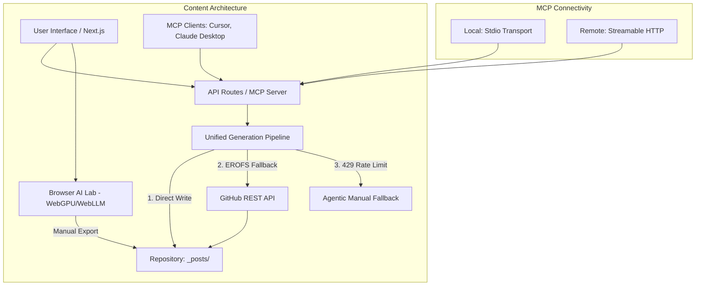

# ✍️ Sudo Make Me Sandwich - AI-Powered Blog Engine

A modern, high-performance personal blog built with **Next.js 15**, **TypeScript**, and **Tailwind CSS**. This project isn't just a blog; it's a cross-platform content engine integrated with the **Model Context Protocol (MCP)** and **Local Browser-Side AI**.

## 🏗️ Architecture



## ✨ Key Features

- **🤖 Model Context Protocol (MCP)**: Access your blog's functions (list posts, read content, generate articles) directly from any MCP client like **Cursor** or **Claude Desktop**.
- **🚀 Hybrid AI Generation**:
  - **Primary**: High-speed **Gemini 3 Flash** cloud pipeline.
  - **Self-Healing**: Automatically falls back to **Agentic Instructions** if API limits (429) are hit.
  - **Local Power**: **Browser AI Lab** allows full post generation on your own GPU using **WebGPU + Llama 3.2**.
- **🔗 Automated Persistence**: Generation pipeline intelligently switches to **GitHub API** commits when running in read-only environments like Vercel.
- **📝 Markdown-Powered**: Full GFM support, syntax highlighting, and **Mermaid** diagrams.
- **🌓 Dark Mode**: Sleek, premium aesthetic with deep dark mode support and modern animations.

## 🚀 Getting Started

### 1. Installation
```bash
git clone https://github.com/sunando94/personalblog.git
cd personalblog
npm install
```

### 2. Configure Environment
Copy `.env.example` to `.env.local` and add:
- `GEMINI_API_KEY`: For the primary generation pipeline.
- `GITHUB_TOKEN`: (Optional) Personal Access Token for Vercel-to-GitHub persistence.

### 3. Run Locally
```bash
# Start the web interface
npm run dev

# Start the Local MCP Runner (Stdio)
npm run mcp
```

## 🛠️ MCP Integration

To connect your local AI (Cursor/Claude) to this blog:
1. Ensure the server is configured in your MCP settings.
2. Use the `generate_blog_post` tool to write high-quality technical content following your project's 1000-line "Zero to Hero" guidelines.

## 📁 System Design

- **`/scripts`**: The heart of the generation pipeline. Includes robust path resolution and cloud-to-agent fallbacks.
- **`/mcp`**: Server definition, local runners, and centralized prompt templates.
- **`/src/app/browser-writer`**: The WebGPU-powered local AI lab.
- **`.agent/docs`**: Your project's core guidelines that the AI strictly follows.

## 🚢 Deployment

Optimized for **Vercel**. 
> **Note**: For the AI generation to work on Vercel, ensure you've added the `GITHUB_TOKEN` environment variable so the script can "push" new posts back to your repository.

---

Built with ❤️ and 🤖 by [Sunando](https://github.com/sunando94)
