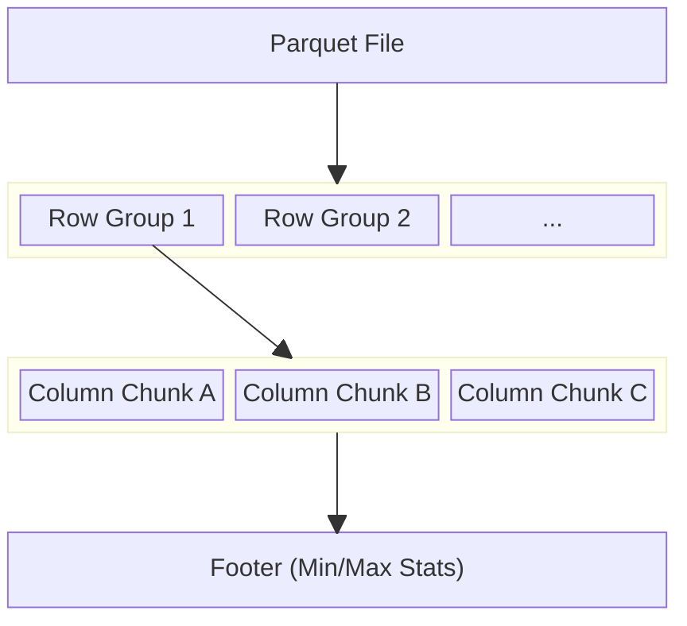
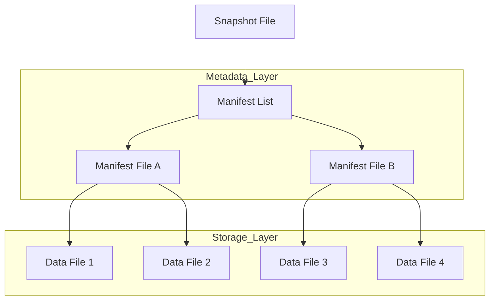
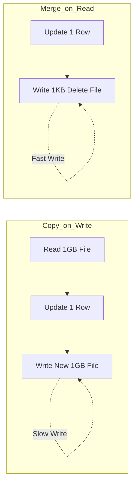
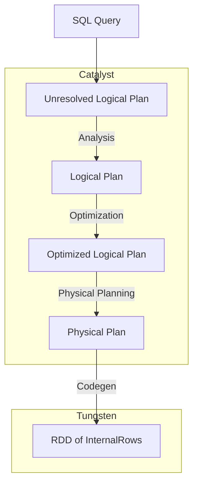

# The Architecture of Performance: Optimizing Spark with Parquet Delta and Iceberg

I remember the first time I tried to run a complex join on a multi-petabyte dataset stored entirely in raw CSV files. It was an absolute disaster. The cluster hummed, the executors groaned, and after four hours of shuffling data across the network, the job simply died with a cryptic out-of-memory error. We often treat Apache Spark like a magic wand that can solve any data scale problem, but the reality is that Spark is only as good as the data it touches. If you feed it inefficiently structured data, you are essentially asking a Formula 1 driver to race through a swamp.

The shift from simple file formats to sophisticated table formats like Delta Lake and Apache Iceberg has fundamentally changed how we build data pipelines. But simply using these formats isn't enough to guarantee performance. You need to understand the underlying mechanics of how Spark interacts with the storage layer to truly squeeze every ounce of efficiency out of your compute resources. We are going to explore the journey from basic file optimization to the advanced metadata management that defines the modern Lakehouse.

## The Foundation of Columnar Efficiency

Before we can talk about the fancy features of Delta or Iceberg, we have to respect the bedrock they are built upon: Apache Parquet. If you are still using row-based formats like CSV or JSON for large-scale analytical workloads, you are leaving an enormous amount of performance on the table.

Think of a row-based file like a traditional grocery store where every single item is scattered randomly. If you only want to buy milk, you still have to walk past the produce, the bakery, and the hardware section. Columnar storage, like Parquet, organizes the store so that all the milk is in one aisle, all the bread is in another, and all the electronics are in the back. When Spark queries a Parquet file for a specific column, it doesn't even look at the other columns. This is called Projection Pushdown.

Parquet takes this a step further with its internal structure. Every Parquet file is divided into Row Groups. Each Row Group contains column chunks, and each chunk is further divided into pages. The magic happens in the Footer. The Footer contains metadata including the min/max values for every column within every Row Group.



1. Spark reads the Footer first.
2. It checks your query filters (e.g., WHERE age > 25).
3. If the metadata says the maximum age in a specific Row Group is 22, Spark skips that entire block of data without reading a single byte of it.

This is Predicate Pushdown. When you combine Projection and Predicate Pushdown, you reduce I/O by orders of magnitude. However, many engineers fail to realize that this only works if your data is physically organized in a way that makes those min/max ranges meaningful. If your data is perfectly shuffled, every Row Group will have a min age of 0 and a max age of 100, and Spark will be forced to read everything.

## The Death by a Thousand Cuts: The Small File Problem

One of the most common ways I see Spark jobs fail is through the accumulation of millions of tiny files. Spark creates a task for every file it needs to read. If you have ten million 1KB files, Spark will spend more time managing the overhead of opening and closing files than actually processing data. This is particularly prevalent in streaming applications where you might be writing data every few seconds.

To solve this, we have to be intentional about our file sizing. Ideally, you want your files to be between 128MB and 1GB. This size is large enough to benefit from Parquet's compression and metadata skipping but small enough to be handled efficiently by a single Spark task. 

In a standard Spark job, you can manage this using the coalesce() or repartition() methods before writing to disk. While repartition() triggers a full shuffle and can be expensive, it ensures that your data is evenly distributed across your output files. coalesce(), on the other hand, avoids a shuffle by merging local partitions, but it can lead to skewed file sizes if your initial partitions are uneven.

```python
# A production-ready approach to handling file sizes in Spark
def write_optimized_parquet(df, path, target_file_size_mb=256):
    # Calculate the number of partitions based on data volume
    # This is a heuristic to prevent the small file problem
    total_size_bytes = df.stats.sizeInBytes if hasattr(df, "stats") else 1024 * 1024 * 1024
    num_partitions = max(1, int(total_size_bytes / (target_file_size_mb * 1024 * 1024)))
    
    df.repartition(num_partitions) \
      .write \
      .mode("overwrite") \
      .parquet(path)
```

## Moving Beyond Files to Delta Lake

While Parquet is a great file format, it isn't a table format. It doesn't handle updates, deletes, or ACID transactions. This is where Delta Lake enters the picture. Delta Lake sits on top of Parquet and introduces a transaction log called the _delta_log.

### 1. Liquid Clustering: The End of Z-Order
In older versions of Delta, we used **Z-Ordering** to co-locate related data. This was powerful but rigid—it was a one-time operation that didn't adapt as data changed, and it conflicted with standard partitioning.

Delta Lake 3.x introduces **Liquid Clustering**, which replaces both Partitioning and Z-Ordering.
*   **Dynamic**: It automatically adjusts data layout as new data arrives.
*   **Flexible**: You can change clustering keys without rewriting the table.
*   **Simple**: No more choosing between `PARTITIONED BY` (for cardinality < 1000) and `ZORDER` (for high cardinality). You just cluster by the columns you query.

```sql
-- Enable Liquid Clustering on creation
CREATE TABLE events_table (
  id INT,
  timestamp TIMESTAMP,
  category STRING
)
USING DELTA
CLUSTER BY (category, timestamp);

-- Trigger clustering (incremental)
OPTIMIZE events_table;
```

### 2. Deletion Vectors: Faster Merges
Traditionally, deleting a single row in a 1GB Parquet file meant rewriting the entire 1GB file (Copy-on-Write).
**Deletion Vectors (DVs)** change this. Instead of rewriting the data, Delta writes a tiny bitmap indicating which rows are deleted.
*   **Write Speed**: Merges and Updates become 5x-10x faster because they don't rewrite data files.
*   **Read Speed**: Readers apply these bitmaps on the fly.
*   **Enabling**: `ALTER TABLE table SET TBLPROPERTIES ('delta.enableDeletionVectors' = true);`

### 3. Column Mapping: Schema Evolution without Pain
Ever tried to rename a column in Parquet? You can't. You have to rewrite the entire dataset.
**Column Mapping** decouples the logical column name (what you query) from the physical column name (what's in the Parquet file).
*   **Rename/Drop**: You can rename or drop columns instantly (metadata only).
*   **Special Characters**: You can finally use spaces or special characters in column names (great for CSV/JSON ingestion).
*   **Enabling**: `ALTER TABLE table SET TBLPROPERTIES ('delta.columnMapping.mode' = 'name');`

## The Iceberg Evolution: Solving the Partition Wall

While Delta Lake relies on a linear transaction log, Apache Iceberg takes a different approach by using a hierarchical metadata tree. This structure allows Iceberg to scale to tables containing trillions of rows without the metadata itself becoming a bottleneck.

One of the most frustrating aspects of traditional Spark partitioning is that the user has to know how the data is partitioned to write an efficient query. If the table is partitioned by truncate(timestamp, 'day'), the user has to manually provide that truncated value in their query. If they just query by the raw timestamp, Spark might perform a full table scan.

Iceberg solves this with Hidden Partitioning. It tracks the relationship between the raw column and the partition transformation. When you query the raw column, Iceberg automatically applies the transformation to your filter and prunes the partitions for you.

1. The user writes: SELECT * FROM logs WHERE ts > '2024-01-01 08:00:00'.
2. Iceberg sees the table is partitioned by day.
3. Iceberg automatically translates the filter to only look in the 2024-01-01 partition.

This separation of the physical layout from the logical query is a game-changer for large teams. It allows data engineers to evolve the partitioning strategy (e.g., moving from daily to hourly partitions) without breaking any existing downstream queries. This is called Partition Evolution.

```python
# Configuring a Spark Session for Iceberg performance
from pyspark.sql import SparkSession

spark = SparkSession.builder \
    .config("spark.sql.extensions", "org.apache.iceberg.spark.extensions.IcebergSparkSessionExtensions") \
    .config("spark.sql.catalog.spark_catalog", "org.apache.iceberg.spark.SparkSessionCatalog") \
    .config("spark.sql.catalog.spark_catalog.type", "hive") \
    .config("spark.sql.catalog.local", "org.apache.iceberg.spark.SparkCatalog") \
    .config("spark.sql.catalog.local.type", "hadoop") \
    .config("spark.sql.catalog.local.warehouse", "/tmp/iceberg-warehouse") \
    .getOrCreate()
```

## Deep Technical Rigor: Metadata and Manifests

To understand why Iceberg can outperform Delta in certain massive-scale scenarios, we have to look at how they handle file lookups. Delta Lake reads its JSON log files and computes the current state of the table. For very large tables with frequent commits, this log can become massive, requiring Delta to create checkpoints (Parquet versions of the log) to speed up the process.

Iceberg uses a tiered metadata structure to facilitate constant-time lookups regardless of table size.



This hierarchy allows Iceberg to perform manifest pruning. Before it even opens a manifest file to see the list of data files, it checks the manifest list metadata. If the entire manifest file only contains data for a partition that doesn't match your query, Iceberg skips the manifest entirely. This O(log N) style lookup is significantly faster than scanning a flat list of files when you are dealing with millions of files.

## Deep Dive: Iceberg V2 and Row-Level Deletes

Most introductions to Data Lakehouses mention "updates and deletes." In the past (Hive), updating a single row in a 1GB file meant rewriting the entire 1GB file. This is the **Copy-on-Write (CoW)** pattern. It's great for read performance (files remain perfectly optimized) but terrible for write performance on large tables.

Apache Iceberg Format V2 introduces **Merge-on-Read (MoR)**, which fundamentally changes this equation.



### The Mechanics of Delta Files
When you run `DELETE FROM table WHERE id = 123` in an Iceberg V2 table:
1.  Iceberg **does not** rewrite the Parquet data file containing row 123.
2.  Instead, it writes a small **Delete File** (often Avro format).
3.  There are two types of Delete Files:
    *   **Position Deletes**: "File X, Row 10,542 is deleted." (Fastest to read, requires finding the position during write).
    *   **Equality Deletes**: "Any row where `id=123` is deleted." (Fastest to write, expensive to read).

**The Read Performance Cost**:
When Spark reads this table, it must now:
1.  Read the original Parquet Data File.
2.  Read the associated Delete Files.
3.  Perform an **anti-join** in memory (or a filter mask) to exclude the deleted rows.

This means your "fast" Parquet scan just became a join operation. If you have thousands of delete files, your read performance will degrade significantly ("The Small Files Problem" usually applies to data files, but "The Small Delete Files Problem" is just as deadly).

**Compaction Strategies**:
To fix the read penalty, you must run compaction to reconcile these deletes.
```sql
CALL catalog.system.rewrite_data_files(
  table => 'db.table',
  options => map(
    'delete-file-threshold', '100', -- Compact if > 100 delete files exist
    'use-starting-sequence-number', 'true'
  )
)
```
This procedure essentially performs the Copy-on-Write operation lazily. It reads the data + deletes and writes out a clean, simplified Parquet file, removing the tombstoned records forever.

## High-Concurrency Conflict Resolution

When you have multiple jobs writing to the same table simultaneously, you enter the realm of Optimistic Concurrency Control (OCC). Both Delta and Iceberg assume that most transactions won't conflict. They allow multiple writers to proceed and only check for conflicts at the very end when they try to commit the transaction.

1. Writer A reads the current state (Snapshot 1).
2. Writer B reads the current state (Snapshot 1).
3. Writer A finishes and commits (Snapshot 2).
4. Writer B finishes and tries to commit.

If Writer A and Writer B were modifying different partitions, both Delta and Iceberg will allow both commits. However, if they were modifying the same data, Writer B will fail with a concurrent modification exception and must retry. In Spark, you can tune how many times a job should retry these commits, which is critical for high-throughput streaming environments.

```python
# Tuning concurrency in Delta Lake via Spark configuration
spark.conf.set("spark.databricks.delta.retries", "10")
spark.conf.set("spark.databricks.delta.retryInterval", "1000ms")
```

## The Mathematical Reality of Data Skipping

Why does all this complexity matter? Let's look at it through the lens of algorithmic complexity. If you have N files and you perform a full scan, your complexity is O(N). For a table with 1,000,000 files, Spark has to coordinate 1,000,000 metadata requests to the underlying storage like S3 or ADLS.

By using partitioning, you reduce the search space to N/P, where P is the number of partitions. If you have 1,000 days of data, you've reduced your work by 1,000x. By adding Z-Ordering or Iceberg's manifest pruning, you are further reducing that search space by filtering at the file level using column statistics. If your Z-Order clusters data such that only 10% of files in a partition contain the relevant range of values, your effective N becomes (N/P) * 0.1. 

The goal of every optimization we've discussed is to get that N as close to 1 as possible. We want Spark to spend its time doing math in memory, not waiting for S3 to return a list of file headers. This is where the difference between a functional pipeline and a performant one lies.

## Practical Strategies for Table Maintenance

Whether you choose Delta or Iceberg, your Spark jobs will eventually slow down if you don't maintain the tables. Data isn't static. Over time, as you perform updates and deletes, the storage layer becomes fragmented.

1. Compaction: This is the process of taking those small files we discussed earlier and rewriting them into larger, optimized Parquet files. In Delta, this is handled by OPTIMIZE. In Iceberg, you use the rewriteDataFiles action.
2. Vacuuming/Expiring Snapshots: Both formats keep old versions of data to support Time Travel. If you don't periodically delete these old files, your storage costs will spiral out of control. In Delta, use VACUUM. In Iceberg, use expireSnapshots.
3. Schema Evolution: One of the biggest killers of Spark jobs is a sudden change in the upstream data format. Both Delta and Iceberg handle schema evolution gracefully, allowing you to add new columns without rewriting the entire table.

```python
# Iceberg Maintenance Action in PySpark
from iceberg.utils import bin_pack

# Compacting small files in an Iceberg table
# This action combines small files into larger ones (512MB)
spark.table("local.db.table_name") \
    .rewriteDataFiles() \
    .targetSizeInBytes(512 * 1024 * 1024) \
    .execute()
```

## Under the Hood: The Engine of Efficiency

To truly master Spark optimization, we need to peel back the layers and look at the engine itself. The performance gains from Parquet, Delta, and Iceberg aren't magic—they are the direct result of how Spark's internal components interact with these formats to perform **Partition Pruning**, **Filter Pushdown**, and **Vectorized Reading**.



### 1. Partition Pruning: `PartitioningAwareFileIndex`
Before Spark even looks at the data, it looks at the file paths. This happens during the logical optimization phase via the `PruneFileSourcePartitions` rule.
*   **The Mechanism**: When you filter by a partition column (e.g., `date='2024-01-01'`), the `FileSourceScanExec` node passes these filters to the `PartitioningAwareFileIndex`.
*   **The Pruning**: This index evaluates the filters against the partition directories. It returns a *pruned* list of files, meaning Spark doesn't even list the files in directories that don't match. For 10 years of daily data, a query on one day skips 99.97% of file listing operations.

### 2. Filter Pushdown: `ParquetFilters` and `FilterApi`
Once the partitions are pruned, Spark has a list of files to read. But we don't want to read every row in those files.
*   **Translation**: Spark's `ParquetFilters` class translates high-level Catalyst expressions (like `EqualTo`, `GreaterThan`) into Parquet-native `FilterPredicate` objects using the Parquet `FilterApi`.
*   **Row Group Skipping**: These predicates are passed to the `ParquetRecordReader`. The reader checks the block metadata (Footer) for each Row Group. If the `min/max` stats for a column exclude the value you are looking for, the reader skips that entire Row Group. This is the mechanism that makes Z-Ordering so powerful—it clusters data to maximize the effectiveness of these min/max checks.

### 3. Vectorized Execution: `VectorizedParquetRecordReader`
For the data that actually needs to be read, Spark switches to high-gear with the Tungsten engine.
*   **The Reader**: Instead of the standard `ParquetRecordReader` which returns one row object at a time, Spark uses the `VectorizedParquetRecordReader`.
*   **ColumnarBatch**: This reader decodes data directly into `ParquetColumnVector` objects (chunks of memory for a single column) and wraps them in a `ColumnarBatch`.
*   **Off-Heap Efficiency**: These vectors are often allocated off-heap. This allows Spark to perform operations using SIMD (Single Instruction, Multiple Data) instructions, processing thousands of rows in a single CPU cycle while bypassing the JVM garbage collector entirely.

### 4. DataSourceV2: The Modern Connector
Modern formats like Iceberg and Delta use the DataSourceV2 (DSv2) API, which structures this flow even more cleanly:
1.  **`ScanBuilder`**: The optimizer calls `pushFilters(filters)`. The source accepts what it can handle (e.g., partition filters) and returns the rest.
2.  **`BatchScan`**: A `BatchScan` is created, which generates `InputPartitions`.
3.  **`PartitionReaderFactory`**: This factory creates the actual readers on the executors, ensuring that the pruning and filtering logic we discussed is baked into the task definition itself.

### Cloud-Native Commit Protocols
Writes are often the bottleneck in cloud (S3/ADLS) environments because these object stores are eventually consistent and don't support atomic renames (a simple `mv` operation in HDFS is essentially a copy-and-delete in S3, which is disjointingly slow).
*   **BindingParquetOutputCommitter**: Spark has evolved to use specialized commit protocols. Instead of the legacy Hadoop approach of writing to a temporary directory and renaming, modern Spark connectors use "binding committers" that manage the commit process via metadata operations, ensuring transactional integrity without the massive I/O penalty of moving files around. This is why using the correct `fs.s3a.committer` settings is essentially mandatory for high-performance pipelines.

## The Optimization Playbook: A Systematic Approach

Understanding the internals is one thing; fixing a slow job at 3 AM is another. When a Spark job is struggling, don't guess. Follow this diagnostic checklist to identify and resolve bottlenecks.

### 1. The Spark UI is Your Stethoscope
Before changing a single line of code, open the Spark UI.
*   **Identify Skew**: Look at the "Stage Detail" view. If the "Max" task duration is vastly longer than the "Median" (e.g., 1 hour vs. 2 minutes), you have data skew.
    *   *Fix*: Salt your keys for joins/aggregations or enable Adaptive Query Execution (AQE) with `spark.sql.adaptive.skewJoin.enabled=true`.
*   **Spot Spilling**: Look for "Disk Spill" and "Memory Spill" columns. Spilling means your tasks are running out of memory and writing intermediate data to disk, which kills performance.
    *   *Fix*: Increase `spark.sql.shuffle.partitions`, increase executor memory, or reduce the concurrency per executor (fewer cores).

### 2. Join Strategies matter
Joins are the most expensive operations.
*   **Broadcast Hash Join**: If one side of your join is small (default < 10MB), Spark should broadcast it to all executors to avoid a shuffle.
    *   *Check*: Verify in the SQL tab that "BroadcastHashJoin" is being used, not "SortMergeJoin".
    *   *Force*: Use the `broadcast()` hint if Spark's estimates are wrong.
*   **Sort Merge Join**: For large-to-large joins, this is standard. However, it requires sorting data, which is expensive. Ensure your data is well-partitioned to minimize the shuffle cost.

### 3. The UDF Trap
User Defined Functions (UDFs), especially in Python (PySpark), are performance killers. They force Spark to serialize data from the JVM to a Python process and back (serde), breaking the vectorized execution model we discussed earlier.
*   *Fix*: Always try to use native Spark SQL functions first. If you must use custom logic, use **Pandas UDFs** (Vectorized UDFs) which use Arrow to transfer data much more efficiently.

### 4. Memory Management & Configuration
*   **Shuffle Partitions**: The default `spark.sql.shuffle.partitions` is 200. This is almost never right for production.
    *   *Too Small*: Large data chunks per task -> OOM and Spilling.
    *   *Too Large*: Millions of tiny tasks -> Overhead dominates execution.
    *   *Recommendation*: Set this so that each partition is roughly 100-200MB. Or, rely on AQE (`spark.sql.adaptive.coalescePartitions.enabled`).

### 5. The Serialization Bottleneck (Kryo)
By default, Spark uses Java serialization, which is flexible but heavy. It adds massive overhead to every object (headers, pointers), causing slow network transfers during shuffles.
*   *Fix*: Enable **Kryo serialization**. It is up to 10x faster and more compact.
    ```scala
    conf.set("spark.serializer", "org.apache.spark.serializer.KryoSerializer")
    ```
*   *Why*: This is critical for network-intensive workloads. If you see high "Shuffle Write Time", this is often the culprit.

### 6. Streaming & State Management
In Structured Streaming, stateful operations (aggregations, stream-stream joins) store data in the "State Store".
*   **The Problem**: The default HDFS-backed state store keeps all state objects in the JVM heap. As your state grows (millions of keys), this leads to massive Garbage Collection (GC) pauses that kill micro-batch latency.
*   **The Fix**: Switch to the **RocksDB State Store**. It manages state in native memory (off-heap) and local disk, removing the GC pressure.
    ```python
    spark.conf.set("spark.sql.streaming.stateStore.providerClass", 
                   "org.apache.spark.sql.execution.streaming.state.RocksDBStateStoreProvider")
    ```
*   **Advanced Tuning**: For even lower latency in Spark 4.0+, enable **Changelog Checkpointing**. Instead of rewriting the full state snapshot every time, it only uploads the deltas (changes) to the checkpoint location.
    ```python
    spark.conf.set("spark.sql.streaming.stateStore.rocksdb.changelogCheckpointing.enabled", "true")
    ```

### 7. Monitoring Streams
Don't fly blind. Use `query.lastProgress` to monitor the pulse of your stream.
*   **The Golden Ratio**: Check `inputRowsPerSecond` vs. `processedRowsPerSecond`. If *input* > *processed* consistently, your system is unstable and building up a backlog. You need to either scale out (add executors) or optimize the micro-batch processing time.

### 8. Case Study: The "Billion Row" Challenge

To ground these concepts in reality, let's walk through a specific optimization journey. This is a composite case study drawn from several real-world production incidents.

**The Scenario:**
We have a daily batch job processing an e-commerce platform's `Clickstream` data.
*   **Fact Table**: `Clicks` (1.2 TB/day, ~2 billion rows). Key: `user_id`, `timestamp`, `item_id`.
*   **Dimension Table**: `Users` (50 GB, ~100 million rows). Key: `user_id`, `demographics`.
*   **The Goal**: Join `Clicks` with `Users` to enrich the clickstream with user demographics, then aggregate by `region` and `item_category`.
*   **The Baseline**: The job runs on a 50-node cluster (4 cores, 32GB RAM each). It currently takes **4.5 hours** and fails 30% of the time with OOM errors.

#### Attempt 1: The Naive Join (The Failure)
The initial code was simple:
```python
clicks = spark.read.parquet("s3://bucket/clicks")
users = spark.read.parquet("s3://bucket/users")

joined = clicks.join(users, "user_id")
result = joined.groupBy("users.region", "clicks.item_category").count()
result.write.parquet("s3://bucket/output")
```
**Diagnosis**:
*   **Skew**: The job failed because of a "straggler" task. One specific task ran for 3 hours while others finished in minutes. Why? We discovered a single `user_id` (likely a bot or test account) had 50 million clicks. In a standard Sort Merge Join, all records for that `user_id` are sent to the same partition on the same executor. 50 million rows x 1KB/row = 50GB. The executor had 32GB RAM. **Result: OOM.**
*   **Shuffle**: Even without the skew, the job was shuffling 1.2TB of data across the network to align the `user_id` keys.

#### Attempt 2: Salting the Skew (The Manual Fix)
Before AQE, the standard fix was "salting". We artificially explode the skewed keys in the dimension table and add a random suffix to the fact table keys to distribute the load.

```python
from pyspark.sql.functions import rand, floor, explode, array, lit

SALT_FACTOR = 10

# 1. Salt the skewed Fact table (Clicks)
# Add a random integer 0-9 to the joining key
salted_clicks = clicks.withColumn("salt", floor(rand() * SALT_FACTOR))

# 2. Replicate the Dimension table (Users)
# Create an array [0, 1, ... 9] and explode it to duplicate every user row 10 times
salted_users = users.withColumn("salt_array", array([lit(i) for i in range(SALT_FACTOR)])) \
                    .select("*", explode("salt_array").alias("salt"))

# 3. Join on Key + Salt
# Now the bot account's 50M records are split into 10 buckets of 5M each.
joined = salted_clicks.join(salted_users, ["user_id", "salt"])
```
**Result**: The job succeeded! No more OOMs. The "straggler" task was broken down.
**New Time**: **2.5 hours**. Better, but still slow due to the massive shuffle and 10x duplication of the `Users` table.

#### Attempt 3: Adaptive Query Execution (The Modern Fix)
We rolled back the complex salting code and enabled AQE.
```python
spark.conf.set("spark.sql.adaptive.enabled", "true")
spark.conf.set("spark.sql.adaptive.skewJoin.enabled", "true")
spark.conf.set("spark.sql.adaptive.skewJoin.skewedPartitionFactor", "5")
```
Spark automatically detected the large partition during the shuffle stage, split it into smaller sub-partitions, and handled the join.
**Result**: Code simplicity returned. Stability achieved. Time remained around **2 hours**.

#### Attempt 4: Bucketing (The Structural Fix)
We realized we join `Clicks` and `Users` by `user_id` *every single day*. Why are we reshuffling the `Users` table every day? It rarely changes. And the `Clicks` data comes in fresh every day; why not write it out pre-shuffled?

We converted our upstream ingestion to use **Bucketing**.
```python
# One-time migration for Users
users.write \
    .bucketBy(4000, "user_id") \
    .sortBy("user_id") \
    .saveAsTable("optimized_users")

# Daily ingestion for Clicks
daily_clicks.write \
    .bucketBy(4000, "user_id") \
    .sortBy("user_id") \
    .saveAsTable("optimized_clicks")
```
**The Magic**: When joining two tables bucketed by the same column into the same number of buckets, Spark treats this as a **Sort Merge Bucket Join**.
*   It recognizes that Partition 1 of Table A corresponds *exactly* to Partition 1 of Table B.
*   **The Shuffle is ELIMINATED**. 1.25 TB of network traffic vanished instantly.
*   Because we also used `sortBy`, the local sort phase of the Sort Merge Join was also skipped.

**Final Result**: **15 Minutes**.
We went from 4.5 hours of crashing jobs to a consistently performant 15-minute pipeline by shifting the cost of the shuffle from "read time" to "write time" and leveraging the structural capabilities of the storage layer.


### 10. Infrastructure Tuning: The Hardware Variable

Software optimization can only go so far. Sometimes, you are simply bound by physics.

**1. NVMe SSDs for Spill**
We mentioned earlier that spilling to disk kills performance. If you cannot avoid spilling (e.g., massive aggregations that exceed RAM), you must spill to the fastest possible medium.
*   Ensure your Spark `spark.local.dir` points to **NVMe SSDs**.
*   In cloud environments (AWS), use instance families like `r5d` or `i3`. The `d` entails physically attached NVMe storage.
*   Standard EBS volumes (network attached storage) will choke under the heavy IOPS of a shuffle spill, often leading to "FetchFailedExceptions" as executors time out waiting for disk I/O.

**2. Garbage Collection: G1GC vs ZGC**
Spark creates billions of short-lived objects. The JVM Garbage Collector is the unsung hero cleaning this mess up.
*   **Parallel GC**: The default in older Java versions. High throughput, but massive "Stop-the-World" pauses.
*   **G1GC (Garbage First)**: The standard recommendation for Spark. It breaks the heap into regions and cleans them incrementally.
    ```bash
    --conf spark.executor.extraJavaOptions="-XX:+UseG1GC -XX:InitiatingHeapOccupancyPercent=35"
    ```
*   **ZGC (Java 17+)**: The future. ZGC promises sub-millisecond pause times regardless of heap size. If you are running Spark on Java 17, switching to ZGC can eliminate the "long tail" latency caused by GC pauses in streaming applications.

**3. Off-Heap Memory**
By default, Spark uses on-heap memory. This subjects all data to GC. Project Tungsten allows Spark to use `sun.misc.Unsafe` to manage memory manually, like C++.
*   Enable it: `spark.memory.offHeap.enabled=true`.
*   Set the size: `spark.memory.offHeap.size=10g`.
*   **Benefit**: Data stored off-heap is not scanned by the GC. This is particularly effective for caching serialized columnar data, freeing up the Heap for your actual computation logic.

### 11. Cost Optimization: Spot Instances and Graceful Decommissioning

Optimization isn't just about speed; it's about cost.

**Spot Instances**:
Cloud providers offer "Spot" instances at up to 90% discount. The catch? They can be preempted (taken away) with 2 minutes' notice.
Spark is resilient, but losing an executor during a shuffle fetch is painful—it forces a recomputation of the lost data phases.

**Decommissioning**:
Spark 3.1+ introduced "Graceful Decommissioning" to handle this.
```bash
spark.decommission.enabled true
spark.storage.decommission.enabled true
spark.storage.decommission.shuffleBlocks.enabled true
```
When a Cloud provider sends the "node termination" signal:
1.  The executor enters "Decommissioning" state.
2.  It stops accepting new tasks.
3.  Critically, it **migrates** its shuffle blocks and cached data to other surviving executors.
4.  When the node finally dies, the data is preserved. The job continues without recomputing the lost stages.

This feature effectively makes Spot instances "safe" for heavy ETL workloads, instantly cutting your compute bill by ~60-70%.

## Choosing the Right Path

If you are heavily invested in the Databricks ecosystem, Delta Lake is often the path of least resistance. Its integration with the Spark engine is deep, and features like Liquid Clustering are making the manual effort of Z-Ordering obsolete. It handles the heavy lifting of indexing and metadata management behind a user-friendly SQL interface.

If you are building a multi-engine environment where Spark, Trino, Flink, and Snowflake all need to touch the same data, Iceberg is often the superior choice. Its metadata-first approach and engine-agnostic design make it the gold standard for open data architectures. It provides a level of interoperability that prevents vendor lock-in and allows different teams to use the tool best suited for their specific workload.

The most important thing to remember is that no table format can save you from a bad data model. You must understand your access patterns. If 90% of your queries filter by organization_id, but you've partitioned your data by random_uuid, no amount of Z-Ordering or manifest pruning will save your performance. Optimization is a conversation between how you store the data and how you intend to ask it questions. 

When you align those two things, Spark stops being a source of frustration and starts being the high-performance engine it was designed to be. You move from fighting the framework to leveraging it, turning hours of compute time into minutes and significant cloud bills into manageable operational costs. This is the difference between an engineer who simply writes code and an architect who builds systems that scale for the long term.