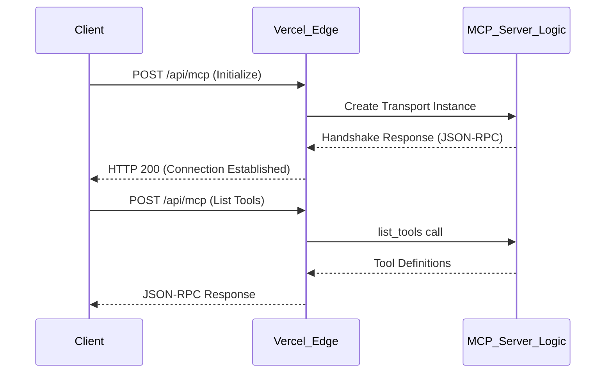

# Deploying MCP Servers on Vercel: A Masterclass in Edge-Ready Tooling

The landscape of artificial intelligence is shifting from models that simply talk to models that actually do. We are moving away from the era of the isolated chatbot and into the era of the agentic system. At the heart of this shift is the Model Context Protocol, or MCP. If you have spent any time recently trying to give an LLM access to your local files, your database, or a third-party API, you have likely encountered the friction of custom integrations. MCP was designed to eliminate that friction by creating a universal standard for how applications provide context and tools to LLMs.

I like to think of MCP as the universal power adapter for the AI age. Before the protocol, every time you wanted to connect a new data source to a model, you had to build a custom bridge. Now, we have a standardized socket. But having the socket is only half the battle. You need to host that socket somewhere reliable, scalable, and close to your users. This is where Vercel comes into play.

In this guide, I am going to walk you through the process of taking an MCP server from a local concept to a globally distributed production environment on Vercel. We will start with the basics of what makes an MCP server tick and then dive deep into the technical weeds of transport layers, serverless execution limits, and the critical configuration required to keep your streams alive.

## The Architecture of Connection

Before we touch a single line of code, we need to understand the relationship between an MCP client and an MCP server. In a typical local setup, these two talk over a standard input/output (stdio) pipe. This is perfect for a local IDE or a desktop application. However, when we move to the cloud, stdio is no longer an option. We need to move the conversation to the web.

On the web, MCP utilizes a transport layer usually based on Server-Sent Events (SSE) or long-polling HTTP requests. This presents a unique challenge for serverless platforms like Vercel. Serverless functions are designed to be ephemeral. They spin up, handle a request, and spin down. Maintaining a long-lived connection for a tool-calling session requires a specific approach to ensure the function doesn't time out or lose state mid-operation.

The Model Context Protocol defines three main primitives: resources, tools, and prompts. Resources are like read-only files or data points. Tools are executable functions that allow the model to take action. Prompts are pre-defined templates that help guide the model's interaction. For our Vercel deployment, we will focus primarily on tools, as they are the most common use case for production-grade agentic workflows.

## Setting Up Your Development Environment

I always recommend starting with a clean TypeScript environment. The MCP SDK is heavily typed, and you will find that the autocompletion and type safety are lifesavers when you are navigating the JSON-RPC structures that underlie the protocol.

1. Initialize a new Next.js project or a standalone Node.js project. If you are targeting Vercel, using the Next.js App Router provides the most straightforward path for creating API routes that can act as your MCP endpoints.
2. Install the necessary dependencies. You will need the core MCP SDK and the specific transport packages for web standards.

```bash
npm install @modelcontextprotocol/sdk zod
```

We use Zod for schema validation. Since an LLM will be the one passing arguments to your tools, you cannot trust the input. You need a rigorous way to validate that the parameters match what your tools expect before you execute any logic.

## Building the MCP Server Core

The core of your server is an instance of the `Server` class provided by the SDK. This instance acts as the orchestrator for all your tools. When I build these, I tend to separate the tool logic from the server configuration to keep the codebase maintainable as the number of tools grows.

I want to show you a production-ready setup for a server that provides a simple but useful tool: a weather lookup or a database query simulator. The goal here is to see how the server negotiates its identity and capabilities.

```typescript
import { Server } from "@modelcontextprotocol/sdk/server/index.js";
import { CallToolRequestSchema, ListToolsRequestSchema } from "@modelcontextprotocol/sdk/types.js";
import { z } from "zod";

const server = new Server(
  {
    name: "my-vercel-mcp-server",
    version: "1.0.0",
  },
  {
    capabilities: {
      tools: {},
    },
  }
);

// Define your tool logic here
const MyToolSchema = z.object({
  location: z.string().describe("The city to look up weather for"),
});

server.setRequestHandler(ListToolsRequestSchema, async () => {
  return {
    tools: [
      {
        name: "get_weather",
        description: "Get the current weather for a specific location",
        inputSchema: {
          type: "object",
          properties: {
            location: { type: "string" },
          },
          required: ["location"],
        },
      },
    ],
  };
});

server.setRequestHandler(CallToolRequestSchema, async (request) => {
  if (request.params.name === "get_weather") {
    const args = MyToolSchema.parse(request.params.arguments);
    // In a real scenario, fetch from an API
    return {
      content: [
        {
          type: "text",
          text: `The weather in ${args.location} is currently 72 degrees and sunny.`,
        },
      ],
    };
  }
  throw new Error("Tool not found");
});
```

The `ListToolsRequestSchema` handler is the first thing the client calls. It is the discovery phase. If you don't list your tool here, the LLM will never know it exists. The `CallToolRequestSchema` is where the actual execution happens. Notice how we use the Zod schema to parse the arguments. This ensures that if the LLM hallucinating a parameter, our server fails gracefully with a validation error rather than a runtime crash.

## The Transport Layer: Bridging Stdio to HTTP

This is the part where most developers get stuck. Locally, you might use `StdioServerTransport`. On Vercel, you need a way to wrap this logic in an HTTP request handler. We use the `WebStandardStreamableHTTPServerTransport`. This transport is designed to work with the standard `Request` and `Response` objects found in modern edge environments.

In a Next.js environment, you will typically create a Route Handler at `/api/mcp/route.ts`. This handler needs to manage two things: the initial connection and the subsequent message exchange.

```typescript
import { WebStandardStreamableHTTPServerTransport } from "@modelcontextprotocol/sdk/server/webStandardStreamableHTTP.js";

// This is a singleton or a long-lived reference in a non-serverless world, 
// but in serverless, we initialize it per request or use a global cache.
let transport: WebStandardStreamableHTTPServerTransport | null = null;

export const runtime = "edge"; // Use the edge runtime for lower latency
export const dynamic = "force-dynamic"; // Crucial for preventing build-time caching

export async function POST(request: Request) {
  transport = new WebStandardStreamableHTTPServerTransport();
  
  // Connect the server to the transport
  await server.connect(transport);
  
  // Handle the request through the transport
  return await transport.handleRequest(request);
}
```

The `force-dynamic` export is not optional. Vercel's build system is aggressive about optimizing static content. Since an MCP server is by definition dynamic—it reacts to real-time queries from an LLM—any attempt to cache the response will break the protocol handshake.

## The Lifecycle of an MCP Request

To understand why the transport layer is so sensitive, we should look at the sequence of events. When an MCP client (like Claude Desktop or a custom web agent) wants to talk to your server, it initiates a handshake.



In a traditional server, this connection might stay open. On Vercel, each block in this diagram might be a completely fresh execution of your function. This is why the statelessness of your MCP server is vital. Any state you need to persist between tool calls (like a session ID or a cursor for pagination) must be stored in an external database like Upstash or Vercel KV.

## Handling the Streaming Requirement

MCP often relies on Server-Sent Events (SSE) for its transport. While the standard POST-based message exchange works for many tools, some complex interactions require a persistent stream. Vercel supports streaming responses, but you have to be careful about how you construct your `Response` object.

When using SSE, you need to set the correct headers to prevent Vercel or any intermediate CDN from buffering the output. If the response is buffered, the client won't receive the messages in real-time, and the LLM will appear to hang.

1. `Content-Type: text/event-stream`
2. `Cache-Control: no-cache`
3. `Connection: keep-alive`

If you are using the `WebStandardStreamableHTTPServerTransport`, the SDK handles much of this for you, but you must ensure your environment supports `ReadableStream`. The Vercel Edge Runtime is perfect for this because it is built on the same standards as modern browsers.

## Security and Authentication

You are deploying a server that can potentially execute code or access private databases. You cannot leave this endpoint open to the public. If someone finds your MCP URL, they could potentially drain your API credits or access sensitive data.

I recommend using a Bearer token strategy. Since the MCP client is often an automated system, you can provide it with a secret key during configuration.

```typescript
export async function POST(request: Request) {
  const authHeader = request.headers.get("authorization");
  if (authHeader !== `Bearer ${process.env.MCP_SECRET_KEY}`) {
    return new Response("Unauthorized", { status: 401 });
  }

  // ... rest of the transport logic
}
```

Make sure to store your `MCP_SECRET_KEY` in the Vercel Environment Variables dashboard. Never hardcode these secrets. Furthermore, if your tools access third-party services (like GitHub or Slack), those credentials should also be handled as environment variables and injected into the tool logic at runtime.

## Advanced Optimization: Cold Starts and Dependency Weight

In a serverless environment, the size of your function matters. If your MCP server imports heavy libraries (like a full AWS SDK or a massive machine learning library), your cold start times will suffer. When an LLM calls a tool, it expects a response within a few seconds. If the function takes three seconds just to boot up, the user experience will feel sluggish.

1. Use tree-shaking to only include the parts of the MCP SDK you actually use.
2. Prefer lightweight fetch-based clients over heavy SDKs for third-party APIs.
3. Use the Edge runtime whenever possible, as it generally has faster cold starts than the Node.js runtime.

If you find that your tools require more than the 50MB limit of the Edge runtime, you will need to fall back to the Node.js runtime. In that case, keep your dependencies to a minimum and consider using a tool like `ncc` to bundle your code into a single file.

## Debugging the Vercel Deployment

Debugging an MCP server on Vercel is notoriously difficult because you can't easily "see" the handshake. I recommend two strategies for when things go wrong.

First, use the MCP Inspector locally. Before deploying to Vercel, run your server in a local environment using the `mcp-inspector` tool. This will help you catch any JSON-RPC schema errors or logic flaws.

Second, leverage Vercel's real-time logs. When you deploy, keep the logs open in a side window. Add descriptive logging inside your tool handlers and transport logic.

```typescript
console.log(`Executing tool: ${request.params.name} with args:`, request.params.arguments);
```

If you see a `405 Method Not Allowed` error, it's likely a routing issue. If you see a `504 Gateway Timeout`, your tool logic is taking too long to execute. Vercel's hobby plan has a 10-second limit for serverless functions, while the Pro plan offers more overhead. If your tool is doing heavy data processing, you might need to optimize the algorithm or move the heavy lifting to a background job.

## The Power of the force-dynamic Flag

I want to circle back to `export const dynamic = "force-dynamic";`. In the Next.js App Router, this flag tells the compiler that the route depends on information that can only be known at request time. For MCP, every request is unique because the JSON-RPC payload changes every time. If you omit this, Next.js might try to pre-render the endpoint during the build process. This will fail because the `WebStandardStreamableHTTPServerTransport` requires a live request object.

Additionally, if you are using any headers or cookies for authentication, `force-dynamic` ensures that these are correctly read for every single invocation. It is the single most important line of configuration for a production MCP server on Vercel.

## Scaling Your Tool Library

As you build more tools, your `setRequestHandler` logic can become cluttered. I suggest implementing a pattern where each tool is its own class or module. You can then register these tools dynamically.

```typescript
const tools = [
  new WeatherTool(),
  new DatabaseTool(),
  new SearchTool(),
];

server.setRequestHandler(ListToolsRequestSchema, async () => ({
  tools: tools.map(t => t.definition),
}));

server.setRequestHandler(CallToolRequestSchema, async (request) => {
  const tool = tools.find(t => t.name === request.params.name);
  if (!tool) throw new Error("Tool not found");
  return tool.execute(request.params.arguments);
});
```

This modularity allows you to test individual tools in isolation and makes it much easier for a team of engineers to contribute to the server without stepping on each other's toes.

The Model Context Protocol is still evolving, and Vercel's infrastructure is constantly being optimized for these kinds of real-time, agentic workloads. By following this structure, you are not just building a script; you are building a robust, scalable piece of infrastructure that allows LLMs to interact with the world in a safe and standardized way. The gap between "knowing" and "doing" is closing, and your MCP server is the bridge.