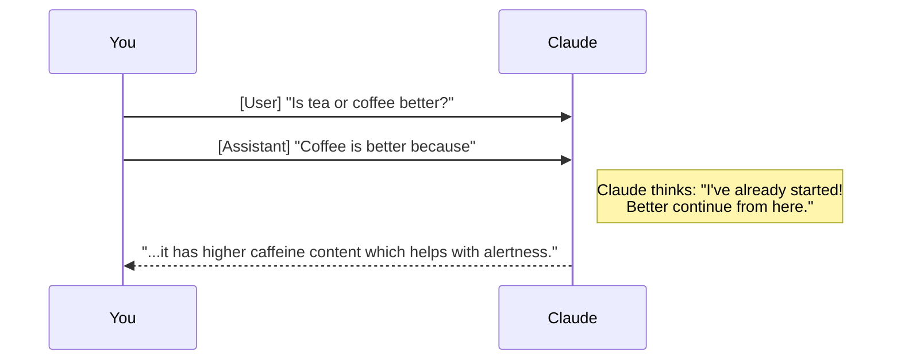
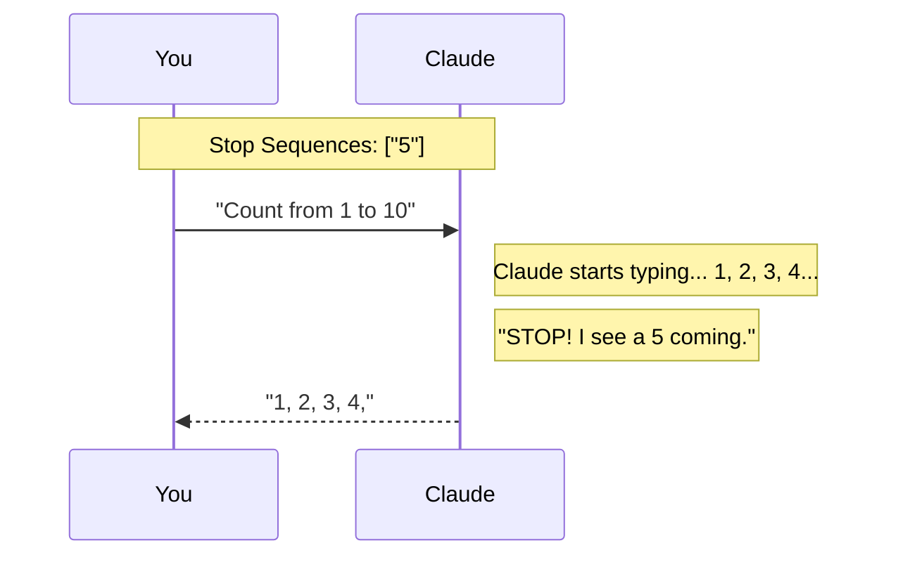

# Surgical Precision: How to Steer Claude with Prefills and Stop Sequences

Imagine you're trying to help a friend finish a sentence, or imagine having a "remote control" that can stop someone from talking the second they say a specific word. In the world of AI, we have exactly that! They are called **Message Prefilling** and **Stop Sequences**.

While writing a good prompt is important, these two techniques give you "surgical" control over how Claude responds. Let's see how they work.

---

## 1. Message Prefilling: Putting Words in Claude's Mouth

Have you ever started a sentence for someone just to get them to agree with you? Like saying, "You're going to clean your room because..." and waiting for them to finish with "...I want to go play outside"? That is exactly what **Message Prefilling** is.

Normally, you send a question and wait. But with prefilling, you send your question AND the very beginning of the AI's answer. When Claude see this, it thinks: *"Oh! I've already started answering this. I should just keep going from right here."*

### Why is this useful?
It’s the ultimate way to "steer" the AI's opinion or forced it into a specific format. If you ask "Is coffee or tea better?" Claude usually tries to be fair and mentions both. But look what happens if we prefill:

```python
# The trick: add a partial Assistant message at the end
messages = [
    {"role": "user", "content": "Is tea or coffee better at breakfast?"},
    {"role": "assistant", "content": "Coffee is better because"}
]

# Claude will now continue exactly from "because"
# It won't repeat your text; it just completes the thought.
```

### The Logic Map
Here is how that conversation looks behind the scenes:



By starting the sentence for Claude, you've completely bypassed the "On one hand, tea is great..." part. You've pointed the car in the direction you wanted!

---

## 2. Stop Sequences: Giving the AI a "Safe Word"

Sometimes, you want the AI to stop talking at a very specific point. Maybe you're building a game and you want the AI to only say one word, or maybe you want it to stop before it starts listing spoilers.

A **Stop Sequence** is a string of characters that acts like a red light. As soon as Claude is about to type that specific word or character, it stops immediately.

### The "Counting" Example
Imagine you tell Claude: "Count from 1 to 10," but you set a stop sequence of **"5"**. 

Claude will start typing: `1, 2, 3, 4,` and then it sees it is about to type `5`. Since `5` is on the stop list, it drops the pen and stops right there. Your final result will just be `1, 2, 3, 4,`.

```python
# Setting up the red light
stop_list = ["5"]

response = client.messages.create(
    model="claude-3-5-sonnet",
    max_tokens=100,
    messages=[{"role": "user", "content": "Count from 1 to 10"}],
    stop_sequences=stop_list
)
```

### The Logic Map
Here is how Claude handles the "Red Light":



---

## When Should You Use These?

These aren't just for fun; they are essential for building real apps. Here are three common ways to use them today:

1.  **Strict Formatting**: If you need the AI to answer in JSON, you can prefill the response with `{ "answer": "` to make sure it doesn't start with "Sure! Here is your JSON:".
2.  **Short Bursts**: If you're making a trivia game, you can set a stop sequence like `\n` (the "Enter" key) so the AI stops after the first line.
3.  **Guided Logic**: Use prefilling to make the AI follow a "Chain of Thought" by starting with "Let's think about this step by step: 1. First,".

## Putting It All Into Practice

Combining **Prefilling** (to start the car) and **Stop Sequences** (to hit the brakes) gives you total control over the AI's "voice." Instead of just asking for help, you're now acting like a director, making sure every word is exactly where it needs to be.

Try it out—start a sentence for Claude today and see where it goes!
