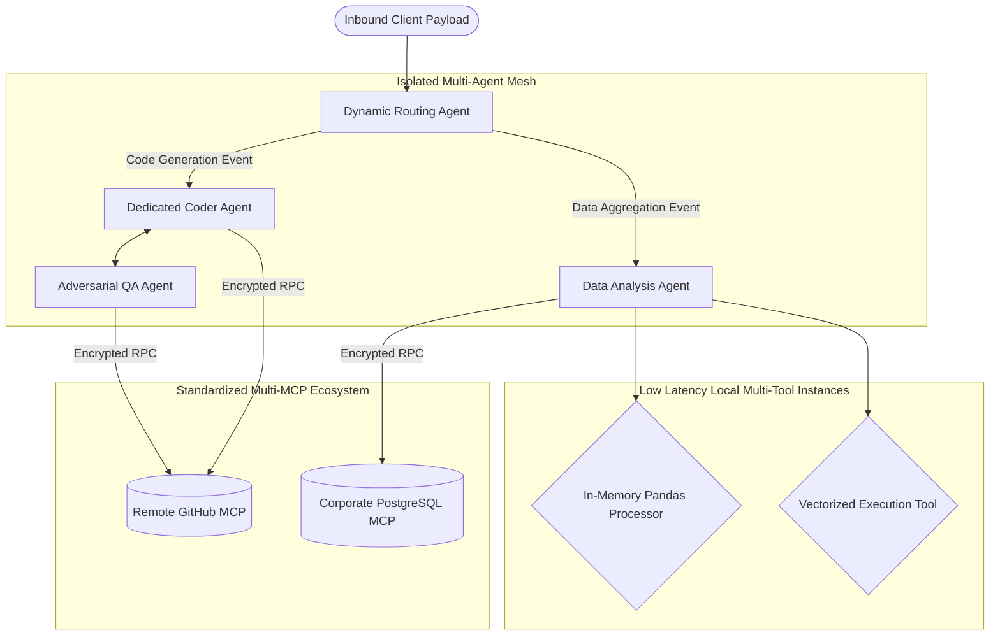

# Agent architechture multi agent vs multi MCP and multi tool

Have you ever tried to build a complex software system and found yourself paralyzed by the sheer number of architectural patterns available? I certainly have. When I first started building Large Language Model applications, I thought giving my model a single prompt and maybe a search function was the pinnacle of engineering capability. I was spectacularly wrong.

We are currently witnessing a massive expansion in how we structure autonomous systems. If you look at the engineering landscape today, you will see three dominant patterns emerging for system orchestration. These are the Multi-Tool pattern, the Multi-Agent pattern, and the newly introduced Multi-MCP, or Model Context Protocol, pattern. 

How do you choose between them? Why does the choice even matter? If we want our systems to reason deeply, scale horizontally across thousands of concurrent sessions, and avoid catastrophic hallucinations when they hit unexpected edge cases, we need to completely understand the underlying mechanics of these architectures. 

I want to take you on a detailed journey. We will start with a simple, tangible analogy to ground these concepts. By the end of this discussion, we will be heavily dissecting state machine transitions, analyzing the mathematical routing probabilities that govern failure rates, and examining enterprise-grade agentic mesh topologies.

## 1. The Core Analogy for System Design

Think about running a high-end restaurant. You have raw ingredients arriving daily, complex preparation steps, a constant influx of asynchronous customer orders, and the critical need for perfectly timed delivery.

1. **The Multi-Tool Approach**: You are the solitary worker in the restaurant. You act as the executive chef, the waiter, and the cashier. To assist you, you maintain a set of highly specialized tools, such as an industrial oven, an automated point-of-sale system, and a high-speed dishwasher. You handle all the cognitive load, planning, and contextual awareness, but you leverage the tools to execute specific mechanical tasks. This represents a single reasoning agent equipped with multiple discrete functions.
2. **The Multi-Agent Approach**: You scale the operation by hiring a specialized pastry chef, a dedicated front-of-house waiter, and a back-office cashier. Each person possesses a highly specific role and a distinct brain, which in our world means a specialized system prompt or a distinct fine-tuned model. They communicate with each other continuously. The waiter receives the order, translates it into kitchen shorthand, passes a discrete message to the chef, and the chef subsequently fires an event back to the waiter when the food is plated. 
3. **The Multi-MCP Approach**: Imagine a scenario where every kitchen appliance and ingredient supplier globally agreed on a universal plug-and-play communication standard. You drop a brand new, highly complex inventory management system into your restaurant. Without writing any custom integration logic, your chef instantly knows how to read data from it, and your cashier instantly knows how to push billing events into it. The Model Context Protocol represents this standardized layer, allowing an agent to instantly connect to external data sources without requiring custom integration wrappers for every single service.

## 2. Deep Dive: Multi-Tool Architecture

The simplest and often most robust starting point for any AI system is a single reasoning engine equipped with multiple deterministic functions. I like to call this the utility knife approach.

In this architectural pattern, you deploy one primary Large Language Model acting as the central intelligence. You provide this model with a strict list of function signatures defined via JSON Schema. The model reasons through the exact user request, statistically decides which tool is most appropriate based on prior probabilities, mathematically generates the necessary arguments, and signals a pause in text generation. Your application layer then intercepts this signal, executes the localized function, and returns the strictly formatted result back to the model.

### 2.1. The Synchronous Execution Flow

1. The user initiates a request via a text prompt or an event trigger.
2. The orchestrating application bundles the user prompt, the historical conversational context, and an array of JSON Schema tool definitions into a single massive payload.
3. The model ingests the payload and returns a specific JSON object representing a tool call request, rather than returning conversational text.
4. The orchestrating application suspends the LLM connection and executes the designated local function using the provided arguments.
5. The orchestrating application captures the raw output of the function, formats it into a specialized tool response envelope, appends it to the message history graph, and invokes the model a second time.
6. The model synthesizes the newly injected data and eventually streams the final aggregated response back to the user.

### 2.2. Production Utilization Guidelines

You should heavily favor this architectural pattern when a given task demands a single, unbroken chain of thought, but strictly requires external structural data or deterministic mathematical calculation to maintain factual accuracy. This pattern remains highly predictable. It minimizes the total hallucination surface area because only one distinct context window is actively mutating the state at any given point in time.

### 2.3. Implementation Mechanics 

Let me show you a concrete implementation using standard TypeScript logic. Notice how tightly coupled the tool definition is to the orchestration code.

```typescript
import { OpenAI } from "openai";

const client = new OpenAI({ apiKey: process.env.OPENAI_API_KEY });

async function executeMultiToolAgent(query: string) {
  const availableTools = [
    {
      type: "function",
      function: {
        name: "getWeather",
        description: "Retrieve exact current weather metrics for a specified location.",
        parameters: {
          type: "object",
          properties: { location: { type: "string" } },
          required: ["location"]
        }
      }
    },
    {
      type: "function",
      function: {
        name: "queryCustomerDatabase",
        description: "Execute a read-only query against the primary user statistics replica.",
        parameters: {
          type: "object",
          properties: { userId: { type: "string" } },
          required: ["userId"]
        }
      }
    }
  ];

  const inferenceResult = await client.chat.completions.create({
    model: "gpt-4-turbo",
    messages: [{ role: "user", content: query }],
    tools: availableTools,
    tool_choice: "auto"
  });

  return inferenceResult.choices[0].message;
}
```

The fundamental limitation here manifests as context window bloat and reasoning degradation. If you provide a single model with fifty distinct, complex tools, its statistical ability to select the correct signature diminishes exponentially. The internal attention mechanism becomes severely diluted across too many intersecting vector probabilities.

## 3. Dissecting Multi-Agent Systems

When a single cognitive engine becomes overwhelmed by context limits or task complexity, we must divide and conquer. Multi-agent systems involve spinning up entirely distinct LLM instances, allocating them independent memory stores, and assigning them highly constrained personas. 

I experienced a massive architectural breakthrough when I abandoned the idea of making one monolithic model write code, extensively review its own code, and then independently test the code. Instead, I isolated the concerns. I created a discrete Coder Agent, an adversarial Reviewer Agent, and an infrastructural QA Agent. 

### 3.1. Advanced Topology Patterns

In distributed multi-agent system design, the specific way agents route communication paths defines the maximum theoretical throughput of the system. We typically encounter three primary topologies.

1. **Hierarchical Routing**: A central manager agent receives the enormous initial task, strictly decomposes it into a tree of sub-tasks, and explicitly routes those tasks to specialized worker agents based on a routing table.
2. **Sequential Pipelines**: A worker finishes a data transformation task and pipes the exact output array directly into the input buffer of the next worker, effectively acting like standard Unix pipes.
3. **Collaborative Mesh Networks**: Independent agents continuously broadcast highly structured messages to a central shared state store or high-speed message bus. They respond entirely independently when they use regex or embedding distance to identify a relevant piece of inbound information.

### 3.2. Directed Acyclic Graph State Management

To definitively prevent agents from trapping themselves in infinite, highly expensive conversational death loops, we almost always model their interaction spaces as Directed Acyclic Graphs. The graph theoretically represents the complete application state, and each individual processing node acts as an isolated agent that is only permitted to mutate a specific slice of that state.

Let us look at a highly rigorous implementation where we construct a minimal graph routing engine.

```typescript
type SystemState = {
  messageLedger: string[];
  activeProcessingTask: string;
  generatedCodeBlock?: string;
  peerReviewFeedback?: string;
};

class RoutingNode {
  agentIdentifier: string;
  executionLogic: (state: SystemState) => Promise<SystemState>;

  constructor(agentIdentifier: string, executionLogic: (state: SystemState) => Promise<SystemState>) {
    this.agentIdentifier = agentIdentifier;
    this.executionLogic = executionLogic;
  }
}

async function executeStateGraph(initialState: SystemState, graphNodes: RoutingNode[]) {
  let volatileState = { ...initialState };
  
  for (let index = 1; index <= graphNodes.length; index++) {
    const activeNode = graphNodes[index - 1];
    volatileState = await activeNode.executionLogic(volatileState);
    if (volatileState.messageLedger.includes("SYSTEM_FATAL_HALT")) {
      break;
    }
  }
  
  return volatileState;
}
```

### 3.3. Compounding Probabilities and Failure Math

Why do poorly designed multi-agent architectures inherently feel so fragile in production environments? The answer lies entirely in basic probabilistic mathematics. 

Assume a leading single LLM instance maintains a ninety percent probability of executing a complex reasoning step completely accurately. The discrete success rate of that single invocation is precisely `0.9`. 
Now, if you intentionally decompose a major user request across a highly rigid sequence of five independent agents, the raw probability of end-to-end system success degrades to `(0.9)^5`. This results in approximately `0.59`, or a fifty-nine percent overall success rate.

This fundamental mathematical equation reveals exactly why linear multi-agent frameworks violently break in production. To counteract this aggressive compounding failure decay, we are forced to introduce massive systemic redundancies. We build retry loops. If the Reviewer Agent rejects the compiler output, the routing layer automatically shifts the payload back to the Coder Agent. The graph fundamentally transitions from acyclic to cyclic, which immediately shifts the engineering burden from managing compounding failure rates to managing infinite cyclical logic loops and astronomical token consumption costs.

## 4. The Model Context Protocol Revolution

Anthropic recently open-sourced the Model Context Protocol, and it represents a profound infrastructural shift. Historically, every single time you needed your orchestration layer to ingest data from an enterprise Jira instance, a local GitHub repository, or an internal PostgreSQL database, you literally had to write highly custom integration glue code and strict API wrappers.

MCP explicitly standardizes how artificial intelligence models connect to arbitrary data sources. It functions identically to how the standard Language Server Protocol revolutionized modern IDEs by standardizing how formatting engines connect to underlying language compilers. 

### 4.1. The Decoupled Client-Server Transport Layer

Instead of tightly defining execution tools directly inside your application orchestration code, you deploy external, long-running processes called Context Servers. 

1. **The MCP Host Interface**: This acts as your primary system orchestrator. It manages the fundamental connection handshakes.
2. **The MCP Local Client**: A lightweight component heavily embedded inside the host application that continually negotiates schemas and intents with entirely separate servers.
3. **The Autonomous MCP Servers**: Highly independent, heavily isolated backend servers running locally via standard IO buffers or remotely via secure Server-Sent Events. These servers expose Resources, abstract Prompts, and executable Tools entirely via standardized JSON-RPC protocols.

### 4.2. Fundamental Paradigm Shifts

When you fully implement a Multi-MCP architecture, your existing single agent baseline or your massive multi-agent mesh immediately inherits an incredibly powerful, entirely decoupled capability layer. You can seamlessly spin up a dedicated GitHub MCP server on port 8000, a local File System MCP server on port 8001, and a proprietary Jira MCP server on port 8002. 

Your active routing agent can now dynamically list every single executable tool available across all connected servers entirely without you ever needing to hardcode a gigantic, continuously growing monolithic array of JSON schemas inside your core typescript logic.

### 4.3. Dissecting the JSON-RPC Handshake Protocol

Let us closely inspect the actual underlying wire protocol. When an active routing agent absolutely needs to understand what specific capabilities an arbitrary server provides, the localized client sends an explicit JSON-RPC payload directly over the standard input/output streams.

```json
{
  "jsonrpc": "2.0",
  "id": "req_84b29c",
  "method": "tools/list",
  "params": {}
}
```

The dedicated context server completely processes this request and immediately responds with the highly exact JSON Schema structurally required by the LLM core.

```json
{
  "jsonrpc": "2.0",
  "id": "req_84b29c",
  "result": {
    "tools": [
      {
        "name": "read_financial_ledger",
        "description": "Read the raw byte contents of the internal financial ledger file.",
        "inputSchema": {
          "type": "object",
          "properties": {
            "absolutePath": { "type": "string" },
            "encryptionKey": { "type": "string" }
          },
          "required": ["absolutePath", "encryptionKey"]
        }
      }
    ]
  }
}
```

This absolute structural isolation guarantees that the core reasoning agent code never needs to understand the incredibly complex implementation details of how to authenticate against or parse the financial ledger. The agent merely routes the semantic tool call intent reliably over the RPC channel, and the deeply isolated context server securely executes it within its own highly constrained execution environment.

## 5. Architectural Synthesis

Now that we have deeply explored the low-level mechanics of all three dominant systems, how do we make massive enterprise-scale architectural decisions? 

1. **Mandate the Single Agent plus Multi-MCP Baseline**. Consider this the absolute new standard for starting any project. Stop writing custom, fragile tool adapters in your core application loop immediately. Heavily utilize the growing, standardized MCP ecosystem to securely grant a massive reasoning model uninterrupted access to every single piece of enterprise context it requires to solve complex problems. 
2. **Embed Multi-Tool Logic Locally Exclusively When Mandated By Performance**. If you are encountering severe latency bottlenecks and absolutely require proprietary, hyper-fast in-memory function executions that simply cannot suffer the serialization overhead of being exposed via a standalone remote MCP server, then and only then should you build them directly into your core active memory agent loop.
3. **Cautiously Escalate to a Multi-Agent Mesh Only Upon Explicit Reasoning Failure**. If your highly tuned single agent begins to statistically struggle to safely maintain extreme focus across a sprawling, fifty-node dependency workflow, you must fragment the workload. Instantiate a dedicated Planner Agent whose single, sole responsibility is intelligently constructing the DAG architecture, and concurrently instantiate highly specialized Worker Agents whose exclusive responsibilities revolve around flawlessly executing edge transition mathematical tasks.

### 5.1. Visualizing the Ultimate Enterprise Hybrid Topology

To truly grasp future-proof system design, consider a highly complex production system that aggressively leverages all three conceptual paradigms simultaneously to maximize both reasoning depth and execution reliability. 



In this massive hybrid topology, we meticulously isolate incredibly complicated logical concerns. We deploy rigid Multi-Agent compartmentalization to securely silo distinctly different thinking personas, completely mitigating the mathematical problem of context dilution across massive prompt windows. We mandate Multi-MCP as the universal, universally secure data access structural fabric layer, granting fragmented agents the capability to rapidly interact with deeply legacy enterprise database infrastructure without relying on brittle custom API bindings. Finally, we intelligently reserve highly synchronous Local Multi-Tool runtime executions entirely for immensely computationally intensive tasks that critically demand shared pointer memory space.

## 6. The Future of Dynamic Context Scoping

As we rigorously design, deeply test, and globally deploy these vast autonomous systems, the hardest fundamental engineering challenge is absolutely not selecting the orchestrator framework. The supreme challenge is intelligent, aggressive context scoping. How do we mathematically ensure that the absolutely correct specific agent possesses exactly the right hyper-focused subset of dense contextual tokens at the precise millisecond it is attempting inference? 

If you aggressively feed an entire hundred-megabyte monolithic codebase to an agent strictly handling a five-line CSS interface tweak, you are literally burning immense amounts of financial runway and dramatically accelerating the severe hallucination degradation gradient. The massive historical evolution from Multi-Tool to Multi-Agent to Multi-MCP architectures is fundamentally and exclusively a war about effectively managing intelligent data scope. Specific tools scope raw executive capabilities. Specific fragmented agents scope cognitive intent. Specific distributed MCP servers dynamically scope enterprise infrastructure.

By thoroughly understanding both the massive computational strengths and the hidden, deeply dangerous mathematical failure modes of each specific paradigm, you can successfully build highly autonomous systems that are not just impressive tech demos, but instead constitute hyper-resilient, production-ready enterprise architectures fully capable of securely generating true, compounding corporate value.
