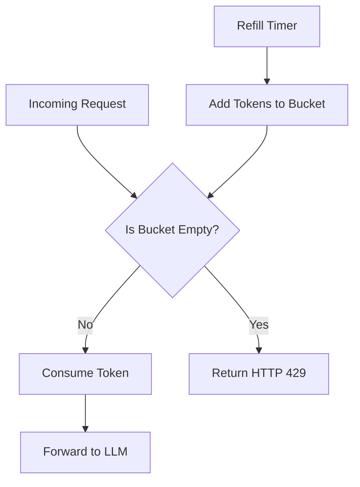

# Navigating the Invisible Walls: Engineering Around Free Tier LLM Rate Limits

I still remember the first time I integrated a Large Language Model into a side project. I had built a sleek interface, the prompts were finely tuned, and the first three requests felt like magic. Then, on the fourth request, everything stopped. My console was flooded with a bright red HTTP 429 error. I had hit the rate limit. If you have spent any time building with the free tiers of OpenAI, Anthropic, or Google Gemini, you have likely stared at that same error message. These limits are not just minor annoyances; they are the fundamental constraints that define how we must architect our applications.

Free tier API access is essentially a high-stakes game of resource management. The providers are offering us a taste of world-class intelligence, but they are doing so on infrastructure that costs millions of dollars to maintain. To keep the lights on and ensure their paying customers get priority, they place strict "invisible walls" around free accounts. Understanding these walls is the difference between a prototype that crashes during a demo and a resilient system that hums along gracefully.

## The Bank Teller Analogy

Think of an LLM API as a very popular bank with only one teller working the "Free Accounts" window. If you walk up and ask a question, the teller answers. If you immediately ask another, they might answer again. But if a line of twenty people suddenly forms, or if you start shouting questions at a rate of one per second, the teller will simply pull down the shutter and put up a sign that says **Come back in sixty seconds**.

This shutter is the rate limiter. In technical terms, it is a mechanism used to control the rate of traffic sent or received by a network interface. For LLMs, this usually manifests in three distinct flavors:

1. Requests Per Minute (RPM): How many times you can hit the "Enter" key.
2. Tokens Per Minute (TPM): How much data (text) you can send and receive.
3. Requests Per Day (RPD): The ultimate hard ceiling that resets every twenty-four hours.

Managing these is not as simple as putting a `setTimeout` in your code. We need to build a system that understands these limits natively.

## The Vocabulary of Constraints

Before we dive into the code, we have to speak the language of the providers. When you make a request to an LLM, the response headers often contain the secrets to your survival. If you ignore these headers, you are flying blind.

1. `x-ratelimit-limit-requests`: The total number of requests you are allowed to make in the current window.
2. `x-ratelimit-limit-tokens`: The total number of tokens (input plus projected output) allowed in the window.
3. `x-ratelimit-remaining-requests`: Exactly how many more times you can knock on the door before it closes.
4. `x-ratelimit-remaining-tokens`: How much "gas" is left in your token tank.
5. `x-ratelimit-reset-requests`: The time (usually in seconds or a timestamp) until your request count resets.
6. `x-ratelimit-reset-tokens`: The time until your token count resets.

Most developers make the mistake of only looking at the response body. A senior approach requires us to inspect these headers after every single call to adjust our application's behavior in real-time.

## The Architecture of Throttling

How do the providers actually enforce these limits? They don't just have a simple counter. They use sophisticated algorithms to ensure fairness and prevent bursts from destabilizing their clusters. The most common algorithm you will encounter is the Token Bucket.

### The Token Bucket Algorithm

Imagine a bucket that can hold a maximum of 3 tokens (RPM). Every minute, the system adds 3 new tokens to the bucket. When you make a request, you take one token out. If the bucket is empty, your request is rejected.



The beauty of the Token Bucket is that it allows for small bursts. If you haven't made a request in five minutes, your bucket is full, and you can fire off three requests in rapid succession. But once those are gone, you are strictly limited to the refill rate.

### The Leaky Bucket Algorithm

The Leaky Bucket is slightly different. Imagine a bucket with a small hole at the bottom. You pour requests into the bucket at any speed. However, the requests "leak" out of the hole to the LLM at a constant, steady rate. If you pour too fast and the bucket overflows, the extra requests are discarded. This is excellent for smoothing out "spiky" traffic, ensuring the LLM sees a perfectly consistent stream of work.

## Implementing a Production Ready Queue

When we are working with free tiers, we cannot just fire and forget. We need an orchestrator. I prefer building a centralized queue that manages the state of our rate limits. This ensures that even if we have multiple functions trying to call the LLM, they all respect the same global constraint.

In this implementation, we will use a combination of a priority queue and an exponential backoff strategy. This ensures that if we do hit a limit, we don't just keep banging on the door and making things worse.

```typescript
import axios, { AxiosResponse, AxiosError } from 'axios';

interface RateLimitState {
  remainingRequests: number;
  remainingTokens: number;
  resetRequestsTime: number;
  resetTokensTime: number;
}

class LLMOrchestrator {
  private state: RateLimitState = {
    remainingRequests: 1, // Start optimistic
    remainingTokens: 1000,
    resetRequestsTime: Date.now(),
    resetTokensTime: Date.now(),
  };

  private queue: Array<{
    task: () => Promise<any>;
    resolve: (val: any) => void;
    reject: (err: any) => void;
    retries: number;
  }> = [];

  private isProcessing = false;

  async enqueue(requestTask: () => Promise<any>, priority = 0) {
    return new Promise((resolve, reject) => {
      this.queue.push({ task: requestTask, resolve, reject, retries: 0 });
      this.processQueue();
    });
  }

  private async processQueue() {
    if (this.isProcessing || this.queue.length === 0) return;
    this.isProcessing = true;

    const item = this.queue.shift();
    if (!item) return;

    try {
      // Check if we are currently in a mandatory wait period
      const now = Date.now();
      const waitTime = Math.max(
        0,
        this.state.resetRequestsTime - now,
        this.state.resetTokensTime - now
      );

      if (this.state.remainingRequests <= 0 && waitTime > 0) {
        console.log(`Rate limit reached. Sleeping for ${waitTime}ms`);
        await new Promise((res) => setTimeout(res, waitTime));
      }

      const response = await item.task();
      this.updateStateFromHeaders(response.headers);
      item.resolve(response.data);
    } catch (error: any) {
      this.handleError(error, item);
    } finally {
      this.isProcessing = false;
      this.processQueue();
    }
  }

  private updateStateFromHeaders(headers: any) {
    // OpenAI specific headers
    if (headers['x-ratelimit-remaining-requests']) {
      this.state.remainingRequests = parseInt(headers['x-ratelimit-remaining-requests']);
      this.state.remainingTokens = parseInt(headers['x-ratelimit-remaining-tokens']);
      
      // Convert reset strings (e.g., "6ms", "1s") to timestamps
      this.state.resetRequestsTime = this.parseResetHeader(headers['x-ratelimit-reset-requests']);
      this.state.resetTokensTime = this.parseResetHeader(headers['x-ratelimit-reset-tokens']);
    }
  }

  private parseResetHeader(headerValue: string): number {
    if (!headerValue) return Date.now();
    const match = headerValue.match(/(\d+)(ms|s|m|h)/);
    if (!match) return Date.now();
    const [, value, unit] = match;
    const multipliers: Record<string, number> = { ms: 1, s: 1000, m: 60000, h: 3600000 };
    return Date.now() + parseInt(value) * (multipliers[unit] || 0);
  }

  private handleError(error: AxiosError, item: any) {
    if (error.response?.status === 429 && item.retries < 5) {
      const retryAfter = parseInt(error.response.headers['retry-after'] || '1');
      const delay = Math.pow(2, item.retries) * 1000 + (retryAfter * 1000);
      
      console.warn(`Hit 429. Retrying in ${delay}ms. Attempt ${item.retries + 1}`);
      
      item.retries++;
      setTimeout(() => {
        this.queue.unshift(item); // Put back to the front
        this.processQueue();
      }, delay);
    } else {
      item.reject(error);
    }
  }
}
```

This orchestrator handles the complexity of back-pressure for us. Instead of checking if we can send a request everywhere in our business logic, we simply wrap our API calls in `orchestrator.enqueue()`.

## Distributed State: The Multi-Node Problem

The implementation above works perfectly for a single process. But what happens when you scale? If you have five serverless functions or three Kubernetes pods running this code, they will all think they have the full quota of the free tier. This is where you hit the limit five times faster than expected.

To solve this, we must move the rate limit state out of the application memory and into a fast, shared data store like Redis.

### Using Redis for Distributed Windows

We can use a Lua script in Redis to ensure that the "check-and-decrement" operation is atomic. This prevents two different pods from seeing that there is 1 request remaining and both taking it.

```lua
-- Redis Lua Script for Atomic Rate Limiting
local key = KEYS[1]
local limit = tonumber(ARGV[1])
local window = tonumber(ARGV[2])

local current = redis.call("INCR", key)
if current == 1 then
    redis.call("PEXPIRE", key, window)
end

if current > limit then
    return -1
else
    return limit - current
end
```

By calling this script before every LLM request, our distributed system acts as a single cohesive unit. Even if we have a hundred nodes, they will all sync with Redis to ensure we never cross the provider's threshold.

## The Token Estimation Challenge

Requests are easy to count. Tokens are hard. Most providers limit you on tokens per minute (TPM). The tricky part is that you don't know exactly how many tokens a request will use until *after* the LLM has finished generating the response.

To handle this in a production system, we use a two-step estimation process:

1. Pre-request Estimation: Use a library like `tiktoken` to count the tokens in your input prompt. Add a "safety buffer" for the expected output length (the `max_tokens` parameter).
2. Post-request Correction: Once the response arrives, the provider tells you exactly how many tokens were used in the headers or the response body. We update our Redis/Local state with this factual data to calibrate the next request.

## Advanced Recovery: The Circuit Breaker Pattern

When working with free tiers, it is not just about rate limits. Sometimes the free-tier clusters are simply overloaded and start timing out. If we keep trying to send requests during a provider-side outage, we are wasting local compute resources.

We should implement a Circuit Breaker.

1. Closed State: Everything is normal. Requests go through.
2. Open State: If we see a high percentage of 429s or 503s over a short window, the circuit "trips." For the next 30 seconds, every call to `enqueue()` fails immediately without even hitting the network.
3. Half-Open State: After the timeout, we allow a single "canary" request through. If it succeeds, we close the circuit. If it fails, we go back to the Open state.

This pattern protects your application from cascading failures. If the LLM is down, your UI should show a "System Overloaded" message immediately, rather than making the user wait for a 30-second network timeout.

## Strategies for Efficiency

Since we are constrained by volume, we must make every token count.

1. Prompt Compression: Strip out unnecessary whitespace and stop words. While LLMs are good at natural language, they are perfectly happy with slightly "compressed" syntax if it saves 15% on tokens.
2. Response Caching: Use an exact-match or semantic cache (like a vector database) to store responses. If a user asks the same question twice, serve it from your cache for $0 cost and 0 token usage.
3. Batching: If your use case isn't real-time (like processing a list of customer reviews), wait until you have 10 items and send them in a single prompt. This reduces the overhead of repetitive instructions in the system prompt.

## The Mathematical Reality of Jitter

When implementing retries, many developers use a simple linear delay (e.g., wait 1s, then 2s, then 3s). This is a mistake. If your system hits a rate limit, it usually means many concurrent requests are trying to get through. If they all retry at exactly the same time, they will hit the limit again in a synchronized wave.

We use Exponential Backoff with Jitter.

$$Delay = (Base \times 2^{attempt}) + random(0, 1000)$$

By adding a random amount of milliseconds (the jitter), we spread the retries out over time. This "de-synchronizes" our requests and gives the rate limit bucket time to refill between individual attempts.

## Conclusion: Empathy for the Infrastructure

Designing around free tier rate limits is often seen as a hurdle, but it is actually a fantastic exercise in distributed systems engineering. It forces us to think about state, consistency, and graceful degradation—concepts that are just as vital when you eventually scale to paid tiers and handle millions of requests.

By treating the rate limit not as a bug to be bypassed, but as a hard physical constraint of the environment, we build software that is inherently more stable. We move away from the "happy path" coding style and toward a resilient architecture that can handle the unpredictable nature of cloud APIs.

Next time you see that 429 error, don't just refresh the page. Look at the headers, check your bucket, and let your orchestrator do the heavy lifting. Your users, and your provider's infrastructure, will thank you.