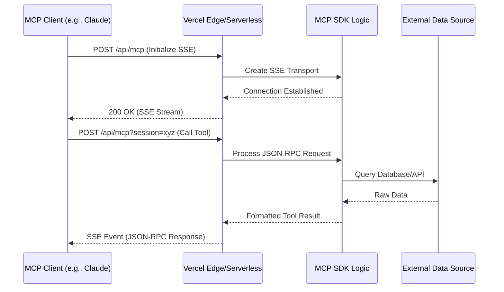

# Scaling Intelligence: A Production Guide to Deploying MCP to Vercel

Imagine you are trying to teach a brilliant researcher everything they need to know about your private company data, but the researcher is trapped in a room with no internet and only the books they brought with them. You can talk to them through a small slot in the door, but you can only pass notes back and forth. This is effectively how Large Language Models operate in their default state. They have immense reasoning capabilities, but they are limited by the static nature of their training data. The Model Context Protocol (MCP) is the high-speed fiber optic cable we are finally plugging into that room. It provides a standardized way for AI models to reach out, query databases, read local files, and interact with web APIs in real-time.

Most developers begin their journey with MCP by running servers locally. You might have a Python or TypeScript script running on your laptop that Claude Desktop connects to via a local process pipe known as stdio. This works beautifully for personal productivity. However, the moment you want to share these capabilities with your team, or integrate them into a production-grade AI application, the local-first approach falls apart. You cannot exactly ask your customers to run a local Node.js process just to use your AI features. This is where Vercel comes into the picture. By deploying MCP servers to a serverless environment, you transform a local utility into a global, scalable API that any MCP-compatible client can consume over the internet.

## The Architectural Shift from Stdio to SSE

The core challenge of moving MCP to the cloud is the transport layer. In a local environment, the client (like Claude Desktop) and the server (your MCP script) communicate via standard input and standard output. It is a persistent, stateful connection where the process stays alive as long as the window is open. Vercel, and serverless platforms in general, operate on a completely different philosophy. They are ephemeral, request-driven, and stateless. You cannot keep a long-running process alive indefinitely without incurring massive costs or hitting platform timeouts.

<div class="agent-visualizer" data-title="Deployment Agent Visualizer" data-preset="agent-deploy"></div>

To bridge this gap, the Model Context Protocol defines a transport layer based on Server-Sent Events (SSE). Unlike a standard REST API where the client sends a request and waits for a single response, SSE allows the server to push updates to the client over a single HTTP connection. This is perfect for MCP because it mimics the asynchronous, two-way nature of the protocol while remaining compatible with the web's request-response architecture. When you deploy to Vercel, you are essentially creating an endpoint that negotiates these SSE connections, allowing an LLM hosted anywhere in the world to call tools and read resources from your hosted server.

The following diagram illustrates the high-level flow of an MCP request in a serverless environment.



## Setting Up the Project Structure

Before we dive into the code, we need to establish a project structure that plays nicely with Vercel's expectations. While you can deploy MCP using several languages, the TypeScript SDK is currently the most mature and easiest to integrate with the Vercel ecosystem. I recommend starting with a clean Next.js project or a simple Turborepo if you plan on building multiple MCP servers.

1. Initialize a new project using your preferred package manager.
2. Install the core MCP SDK dependencies. You will need `@modelcontextprotocol/sdk` as the primary library.
3. Ensure your `tsconfig.json` is configured for modern Node.js features, specifically targeting `ESNext` to take advantage of top-level await and modern module resolution.

The directory structure should look something like this:

1. `/src/app/api/mcp/route.ts`: The main entry point for the SSE connection.
2. `/src/lib/mcp/server.ts`: The logic defining your tools, resources, and prompts.
3. `/src/lib/mcp/tools/`: A directory to organize individual tool implementations as they grow in complexity.

## Implementing the MCP Server Logic

Let's build a production-ready MCP server. For this example, we will create a server that acts as a bridge to a internal product database. This is a common use case for senior engineers who need to give an LLM the ability to "understand" the current state of a complex system without manual data exports.

In your `server.ts` file, you will define the server instance. Note how we handle the initialization and the definition of tools. We are not just returning strings; we are providing the LLM with a schema it can reason about.

```typescript
import { Server } from "@modelcontextprotocol/sdk/server/index.js";
import { 
  CallToolRequestSchema, 
  ListToolsRequestSchema 
} from "@modelcontextprotocol/sdk/types.js";

/**
 * We initialize the server with basic metadata. 
 * This metadata is sent to the client during the handshake.
 */
export const mcpServer = new Server(
  {
    name: "production-inventory-manager",
    version: "1.0.0",
  },
  {
    capabilities: {
      tools: {},
      resources: {},
    },
  }
);

/**
 * Tool definition for querying inventory.
 * We use JSON Schema to strictly define the arguments the LLM must provide.
 */
mcpServer.setRequestHandler(ListToolsRequestSchema, async () => {
  return {
    tools: [
      {
        name: "get_product_stock",
        description: "Returns the current stock level for a given product SKU.",
        inputSchema: {
          type: "object",
          properties: {
            sku: {
              type: "string",
              description: "The unique stock keeping unit identifier.",
            },
          },
          required: ["sku"],
        },
      },
    ],
  };
});
```

The logic above sets the stage, but it is the `CallToolRequestSchema` handler where the real work happens. This is where you connect to your database (like Prisma, Drizzle, or a direct fetch to another microservice). In a serverless environment, you must be mindful of connection pooling. If your MCP server is hit frequently, you could easily exhaust your database connections.

```typescript
mcpServer.setRequestHandler(CallToolRequestSchema, async (request) => {
  const { name, arguments: args } = request.params;

  if (name === "get_product_stock") {
    const sku = String(args?.sku);
    
    // In a real-world scenario, you would perform a database lookup here.
    // For this demonstration, we simulate a robust data retrieval process.
    const stockData = await mockDatabaseQuery(sku);

    return {
      content: [
        {
          type: "text",
          text: `The current stock for SKU ${sku} is ${stockData.count}. Location: ${stockData.warehouse}.`,
        },
      ],
    };
  }

  throw new Error(`Tool not found: ${name}`);
});

async function mockDatabaseQuery(sku: string) {
  // Simulate latency to mimic a real production environment
  await new Promise((resolve) => setTimeout(resolve, 150));
  return {
    sku,
    count: Math.floor(Math.random() * 1000),
    warehouse: "North-East Distribution Center",
  };
}
```

## Creating the Vercel Route Handler

Now comes the crucial part: exposing this server over HTTP using Vercel's Route Handlers. MCP's SSE transport requires two distinct endpoints, or one endpoint that handles two different methods. The first is a `GET` request to establish the SSE stream. The second is a `POST` request where the client sends JSON-RPC messages to the server.

Vercel's Edge Runtime is often preferred for these types of tasks because of its lower latency and faster cold starts. However, if your MCP tools rely on heavy Node.js libraries that aren't Edge-compatible, the standard Serverless Node.js runtime is perfectly fine.

```typescript
import { SSEServerTransport } from "@modelcontextprotocol/sdk/server/sse.js";
import { mcpServer } from "@/lib/mcp/server";
import { NextRequest, NextResponse } from "next/server";

/**
 * This map stores active transports. 
 * In a distributed serverless environment, you should ideally move 
 * the session state to a shared store like Redis if sessions 
 * need to persist across different function invocations.
 */
const transports = new Map<string, SSEServerTransport>();

export async function GET(request: NextRequest) {
  const { searchParams } = new URL(request.url);
  const sessionId = searchParams.get("sessionId") || Math.random().toString(36).substring(7);

  const transport = new SSEServerTransport(
    `/api/mcp?sessionId=${sessionId}`,
    NextResponse.next()
  );

  transports.set(sessionId, transport);
  
  // We need to handle the connection close to prevent memory leaks
  transport.onclose = () => {
    transports.delete(sessionId);
  };

  await mcpServer.connect(transport);

  // Return the SSE stream to the client
  return (transport as any).handleSseRequest(request);
}

export async function POST(request: NextRequest) {
  const { searchParams } = new URL(request.url);
  const sessionId = searchParams.get("sessionId");

  if (!sessionId || !transports.has(sessionId)) {
    return new NextResponse("Session not found", { status: 404 });
  }

  const transport = transports.get(sessionId)!;
  await transport.handlePostRequest(request as any, NextResponse.next() as any);
  
  return new NextResponse("Accepted", { status: 202 });
}
```

## Handling Statelessness and State

One of the nuances of deploying to Vercel is that the `transports` map in the code above exists only in the memory of the specific container handling the request. If Vercel spins up five different instances of your function to handle traffic, a `POST` request might hit Instance A while the original `GET` (SSE) request is being held open by Instance B. This will result in a 404 Session Not Found error.

To solve this for true production scale, you have three options:

1. **Sticky Sessions**: This is difficult to achieve with standard Vercel serverless functions.
2. **Short-lived connections**: Treat every tool call as a discrete event, though this slightly violates the intended design of MCP's persistent transport.
3. **Shared State Store**: Use a high-performance key-value store like Upstash Redis to track active sessions and route messages.

For most architectural needs, the standard SSE transport provided by the SDK handles the basics, but for high-concurrency environments, you might need to implement a custom transport that uses a pub/sub mechanism (like Redis Pub/Sub) to route messages between the HTTP POST handler and the persistent SSE stream regardless of which physical server they land on.

## Security Considerations for Remote MCP

When your MCP server lived on your laptop, security was as simple as "don't let anyone else touch your laptop." Once it is on the public internet, you have essentially given the world an API that can execute logic on your backend. You must treat your MCP endpoints with the same rigor as any other production API.

1. **Authentication**: Use Bearer tokens or API keys. The MCP client should include these in the headers of the initial SSE request and subsequent POST requests.
2. **Rate Limiting**: AI models can be "chatty." A single prompt might trigger dozens of tool calls. Implement rate limiting based on the `sessionId` or user ID to prevent your backend from being overwhelmed.
3. **Input Validation**: Never trust the arguments provided by the LLM. While we define a schema, the LLM might still send hallucinated or malicious data. Always validate SKU formats, escape SQL queries, and sanitize strings before they hit your downstream systems.

Here is how you might wrap the Vercel route with a simple API key check:

```typescript
export async function POST(request: NextRequest) {
  const apiKey = request.headers.get("x-api-key");
  
  if (apiKey !== process.env.MCP_SECRET_KEY) {
    return new NextResponse("Unauthorized", { status: 401 });
  }

  // ... rest of the logic
}
```

## Mathematical Modeling of Latency and Throughput

When designing these systems, it is helpful to model the expected latency. The total time for an LLM to receive a tool result ($T_{total}$) can be expressed as:

$$T_{total} = T_{client\_to\_vercel} + T_{cold\_start} + T_{mcp\_logic} + T_{data\_source} + T_{sse\_push}$$

In a serverless environment, $T_{cold\_start}$ is the most variable factor. By using the Edge Runtime, we can often reduce this to under 50ms. The $T_{mcp\_logic}$ is usually negligible (sub-5ms), making $T_{data\_source}$ (your database query) the primary bottleneck. If your tool call takes longer than Vercel's function timeout (typically 10-60 seconds depending on your plan), the connection will sever. For long-running tasks, you should implement a polling pattern or a status-check tool rather than holding the MCP tool call open.

## Deploying and Configuring the Client

Once your code is pushed to GitHub and deployed via Vercel, you will have a URL like `https://my-mcp-server.vercel.app/api/mcp`. To use this in a client like Claude Desktop, you need to modify your `claude_desktop_config.json`. Unlike local servers that use `command`, remote servers use the `sse` transport type.

```json
{
  "mcpServers": {
    "inventory-manager": {
      "transport": {
        "type": "sse",
        "url": "https://my-mcp-server.vercel.app/api/mcp",
        "headers": {
          "x-api-key": "your-secret-key-here"
        }
      }
    }
  }
}
```

This configuration tells the client to initiate an SSE connection to your Vercel deployment. Every time the LLM decides to check stock levels, it will send a JSON-RPC message through that connection, your Vercel function will compute the answer, and the result will stream back to the AI's context window.

## Monitoring and Observability

In a production setting, you cannot fly blind. You need to know how often tools are failing and what the average response time is. Since MCP is based on JSON-RPC, you should log the method names and the success/failure status of every request. 

1. **Structured Logging**: Use a service like Axiom or BetterStack to ingest logs from Vercel. Log the `requestId` to trace a single tool call from the initial POST to the final SSE push.
2. **Error Boundaries**: Wrap your tool handlers in try-catch blocks. Instead of letting the function crash, return a meaningful error message to the LLM. If the LLM knows *why* a tool failed (e.g., "SKU not found" vs "Database timeout"), it can often recover or ask the user for clarification.
3. **Performance Monitoring**: Track the duration of your data source queries. If you notice $T_{data\_source}$ creeping up, it may be time to implement caching for frequently accessed MCP resources.

The transition from local MCP development to Vercel-hosted infrastructure represents a significant leap in the utility of AI agents. By moving the context bridge to the cloud, you enable a world where AI doesn't just guess based on past data, but actively interacts with your current, living digital ecosystem. Whether you are building internal tools for your engineering team or customer-facing AI features, the serverless MCP pattern provides the scalability and flexibility required for the next generation of agentic software.