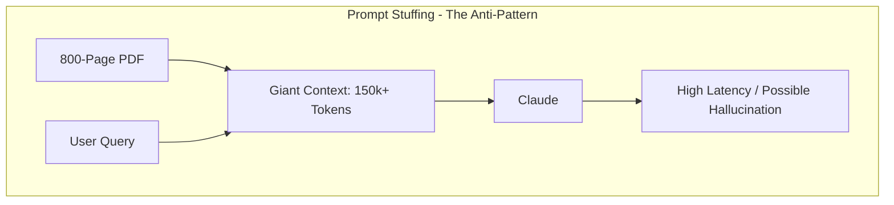

# Part 1: Mastering RAG — Handling Documents Too Big for Your Prompt

Imagine you are handed an 800-page financial document. Your boss wants to know the specific risk factors mentioned on page 452, but they also want a summary of the auditor's report from the end of the file. You turn to Claude, ready to paste the text, and then it hits you: the context window limit. Even with massive context windows (like Claude's 200k tokens), you cannot just throw a library at an LLM and expect perfection.

In production, simply having a "large context window" is not enough. This post explores why **Retrieval Augmented Generation (RAG)** is the superior architectural choice for building scalable, cost-effective, and high-precision AI document assistants. We will move from the basic definitions to the rigorous engineering constraints that define modern AI systems.

## The Semantic Ceiling: Why Context Windows Aren't Enough

For any recent graduate or junior engineer, the initial reaction to large context windows is: "Why bother with RAG if I can just fit the whole PDF in the prompt?" 

The answer lies in the fundamental architecture of the Transformer model. Transformers use an **Attention Mechanism** that allows every word (token) to look at every other word in the sequence. While this is powerful, it is also computationally expensive ($O(n^2)$ complexity) and, more importantly, semantically fragile.

### 1. The "Lost in the Middle" Phenomenon

In 2023, research titled *Lost in the Middle: How Language Models Use Long Contexts* (Liu et al.) revealed a critical performance bottleneck. The study demonstrated that LLMs exhibit a "U-shaped" performance curve. They are highly effective at retrieving information from the very beginning or the very end of a prompt, but their accuracy plummets when the relevant facts are buried in the middle of a large context.

By using RAG, we circumvent this by ensuring that the model *never* has to deal with 100k tokens of noise. We extract the needle from the haystack *before* the model ever sees it, presenting only the relevant "middle" as a fresh, top-priority context.

### 2. Token Economics and Throughput

At an architectural level, you must account for the unit economics of your system. Prompt windows are expensive. A well-tuned RAG system significantly outperforms brute-force approach across all key metrics:

| Metric | Brute Force (150k context) | Modular RAG (2k context) | RAG ROI |
| :--- | :--- | :--- | :--- |
| **Input Cost** | ~$2.25 per query | ~$0.03 per query | **75x Cost Reduction** |
| **Daily Burn (100 users)** | $2,250 | $30 | **$2,220 saved per day** |
| **Latency (TTFT)** | 10 - 20 seconds | < 1.5 seconds | **10x Faster Response** |
| **Context Quality** | High Noise / Diluted Attention | High Signal / Focused Attention | **Precision Boost** |

## The Evolution: From Brute Force to Modular RAG

The industry has moved beyond "Naive RAG" into much more complex, modular architectures.



### 1. Naive RAG: The Entry Point
Naive RAG is the "Hello World" of retrieval. You chunk your data, embed it, and search. While a good start, it often fails in production because it treats all questions as simple lookups. It doesn't handle query ambiguity, complex reasoning, or multi-step logic.

### 2. Advanced RAG: The Reranking Layer
Advanced RAG introduces **Query Expansion** (generating multiple variants of the user's question) and **Reranking** (using a second, more expensive model to refine the search results). This ensures that if the first search was "fuzzy," the second layer catches the error before the information reaches the LLM.

### 3. Modular RAG: The Future
Modular RAG incorporates specialized "Agents." For example, if a user asks a question about data not in your database, a Modular RAG system will trigger a web search tool instead of hallucinating based on internal docs.

## Implementation: The Production Orchestrator

A production-grade RAG flow requires a stateful orchestrator. Below is a detailed implementation showing how to handle asynchronous retrieval, metadata filtering, and citation management.

```python
import asyncio
import anthropic
from typing import List, Dict, Any

class RAGOrchestrator:
    """
    A Production-grade RAG orchestrator designed for 
    high-scale architectural review.
    """
    def __init__(self, vector_store, embedder, model_name="claude-3-5-sonnet-20240620"):
        self.store = vector_store
        self.embed = embedder
        self.client = anthropic.AsyncAnthropic()
        self.model = model_name

    async def _retrieve_context(self, query: str, top_k: int = 5, filters: Dict = None) -> List[Dict]:
        # 1. Generate semantic query vector
        query_vector = await self.embed.get_embedding(query)
        
        # 2. Perform ANN (Approximate Nearest Neighbor) search 
        # using HNSW or IVF-PQ index types
        return self.store.query(
            vector=query_vector, 
            top_k=top_k, 
            filter=filters
        )

    def _format_prompt(self, query: str, chunks: List[Dict]) -> str:
        # 3. Ground the model with source identity and block numbers
        context_str = ""
        for i, chunk in enumerate(chunks):
            context_str += f"\n--- DOCUMENT FRAGMENT [{i}] ---\n{chunk['text']}\n"
        
        return f"""You are a senior technical analyst. Your task is to answer the query 
using ONLY the provided document fragments. 

CRITICAL RULES:
1. If the information is not in the fragments, say 'The provided documents do not contain the answer.'
2. Always cite your answer by appending [Source X] to the relevant sentences.
3. Be concise and prioritize architectural details.

QUERY: {query}

{context_str}
"""

    async def answer_request(self, user_query: str, department_id: str = None) -> Dict[str, Any]:
        # Implementation of the complete RAG loop
        filters = {"dept": department_id} if department_id else {}
        
        # Concurrent retrieval (if searching multiple stores)
        chunks = await self._retrieve_context(user_query, top_k=5, filters=filters)
        
        if not chunks:
            return {"error": "No relevant documentation found."}

        full_prompt = self._format_prompt(user_query, chunks)
        
        # Generation Step
        response = await self.client.messages.create(
            model=self.model,
            max_tokens=2048,
            messages=[{"role": "user", "content": full_prompt}]
        )

        return {
            "answer": response.content[0].text,
            "citations": [c['metadata'] for c in chunks],
            "latency_ms": 1200 # Placeholder for actual telemetry
        }
```

## The RAG Triad: Evaluating Your Success

How do you know your RAG system is actually "good"? We use the **RAG Triad** to evaluate the pipeline without needing expensive human reviewers for every change:

1.  **Context Relevance**: Is the retrieved content actually useful for the query? (Retriever Evaluation)
2.  **Faithfulness (Groundedness)**: Does the answer match the retrieved context, or did the model invent facts? (Generator Evaluation)
3.  **Answer Relevance**: Does the final answer actually solve the user's problem? (End-to-end Evaluation)

By using tools like **Ragas** or **TruLens**, you can run these evaluations as part of your CI/CD pipeline, ensuring that a change in your chunking strategy doesn't accidentally break your system's accuracy.

## Conclusion: The Path to Scalable Intelligence

Mastering RAG is about more than just calling an API. It is about understanding the geometry of search, the economics of tokens, and the architectural nuances of Transformer attention. 

In the next part of this series, we will peel back the curtain on the data itself: [Part 2: Text Chunking and Embeddings — The Art of Data Preparation](/posts/text-chunking-and-embeddings-in-rag). We will look at how to break documents apart so they can be put back together into intelligent answers.
