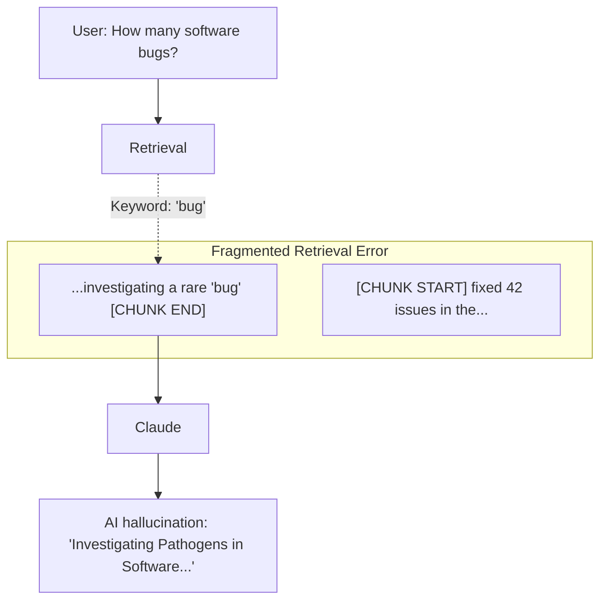

# Part 2: Text Chunking and Embeddings — The Art of Data Preparation

In our [architectural overview](/posts/mastering-rag-retrieval-augmented-generation), we established that RAG is the gold standard for scaling AI applications. But the most common reason RAG systems fail in production isn't the Large Language Model (LLM)—it's **poor data preparation**. 

You cannot simply dump documents into a vector database and expect Claude or GPT-4 to make sense of the noise. If you feed your model fragmented, noisy, or semantically broken "chunks" of text, the model will output incorrect, hallucinated, or incomplete answers. This post explores the engineering of **Text Chunking** and the mathematics of projecting those chunks into the high-dimensional space of **Embeddings**.

## The Semantic Collision Problem

Imagine you are processing a 1,000-page manual that contains both medical research and software engineering notes. If your chunking strategy is purely character-based (e.g., splitting every 1,000 characters without looking at the content), you might split a sentence precisely at a sensitive keyword like "bug."

A user asking "How many critical software bugs were in the latest patch?" might pull a chunk discussing a "rare medical bug" (a biological pathogen) simply because the keyword matched. Because the surrounding software-engineering context was lost in the split, the retrieval system fails to distinguish between the two concepts. This is a **Semantic Collision**, and it is the primary source of failure in "Naive RAG" setups.



## The Taxonomy of Chunking Strategies

From a systems engineering perspective, you must treat chunking as an optimization problem where you balance **Retrieval Precision** (small chunks find exact matches) with **Generation Context** (large chunks provide the model with enough background).

### 1. Fixed-Size Chunking (The Baseline)
This is the simplest approach: take every $N$ characters or tokens and create a chunk. 
*   **The Overlap Rule**: You must include an "overlap" (e.g., 10-20% of the chunk size). This ensures that if a critical relationship exists between the end of Chunk A and the start of Chunk B, that context is preserved in both.
*   **Verdict**: Best for messy, unstructured logs or plain text where no hierarchy exists.

### 2. Recursive Character Splitting (The Production Standard)
Instead of a hard count, recursive splitting respects the document hierarchy. It tries to split at the "largest" separator first (e.g., double newlines for paragraphs), then single newlines, then spaces. This keeps semantically related sentences together in the same unit.

```python
# Conceptual implementation of a Recursive Character Splitter
class RecursiveSplitter:
    def __init__(self, separators=["\n\n", "\n", " ", ""], chunk_size=512):
        self.separators = separators
        self.chunk_size = chunk_size

    def split(self, text):
        # Implementation tries to find the largest separator 
        # that results in a chunk smaller than self.chunk_size.
        # This preserves paragraph and sentence boundaries.
        pass
```

### 3. Markup-Aware Chunking (HTML/Markdown)
If your source files are Markdown or HTML, **Knowledge of the structure is your greatest asset**. You should chunk based on headers (`#`, `##`, `###`). If a section is too large, you split its children. This ensures that a header is *always* associated with its content.

### 4. Semantic Chunking (The State-of-the-Art)
This technique doesn't use character counts at all. It uses sentence embeddings to calculate the "meaning" of every sentence. It only breaks a chunk when the **Cosine Distance** between the current sentence and the previous one exceeds a specific threshold. This creates "logical" chunks that mirror human thought patterns.

## The "Parent-Document" Retrieval Pattern

A highly sophisticated pattern for technical documentation is the **Parent-Child** approach. This solves the fundamental tension: small chunks are better for search (less noise), but large chunks are better for generation (more context).

1.  **Child Chunks**: Very small fragments (e.g., 128 tokens) are embedded and stored in the vector database.
2.  **Parent Chunks**: The larger original section (e.g., 1024 tokens) is stored in a high-speed key-value store.
3.  **The Retrieval Loop**: When a "Child" is matched by semantic search, we don't send it to the LLM. Instead, we use its metadata to fetch its **Parent** and send that comprehensive context instead.

```python
from typing import List, Dict
import uuid

class ParentChildStore:
    def __init__(self, vector_db, doc_store):
        self.vector_db = vector_db
        self.doc_store = doc_store

    def ingest(self, doc_text: str):
        parent_id = str(uuid.uuid4())
        # Store full parent for context
        self.doc_store[parent_id] = doc_text
        
        # Split into small children for high-precision search
        children = self._split_to_children(doc_text)
        
        for child_text in children:
            self.vector_db.add(
                embedding=self.embed(child_text),
                metadata={"parent_id": parent_id, "text": child_text}
            )

    def search(self, query: str) -> List[str]:
        # Search against child vectors
        results = self.vector_db.query(self.embed(query))
        
        # Pull parent documents for the LLM
        parent_contexts = []
        for res in results:
            parent_id = res.metadata["parent_id"]
            parent_contexts.append(self.doc_store[parent_id])
            
        return list(set(parent_contexts)) # Deduplicate
```

## Text Embeddings: High-Dimensional Manifolds

Once text is chunked, it must be projected into a **Vector Space**. An embedding model (like `voyage-3-large` or `text-embedding-3-small`) is a deep neural network that has been trained to map similar concepts to similar coordinates in a high-dimensional star map (often 1,536 dimensions).

### 1. The Logic of Dimensions
More dimensions do not always mean better retrieval. While a 3,072-dimensional vector can capture more nuance, it also doubles your storage costs and increases query latency. Most production systems find the "sweet spot" at 768 or 1,536 dimensions.

### 2. Asymmetric Embedding: Query vs. Document
Modern models account for the fact that a user query ("How to fix X?") is short and intent-based, while a document chunk ("In order to fix X, first...") is long and fact-based. Models like **VoyageAI** provide specific `input_type` flags (`query` vs. `document`) to optimize the mathematical projection for these two different roles.

### 3. Matryoshka Embeddings
A new frontier in embedding tech allows for "nested" vectors. You can store a 1,536-dimensional vector but only retrieve the first 256 dimensions for a "coarse" fast search, then use the full vector for a "fine" reranking. This provides $O(1)$ scaling for massive datasets.

## Implementation: Batch Proccessing and Error Handling

When building for production, you must handle the realities of network latency and API limits.

```python
import voyageai

client = voyageai.Client(api_key="API_KEY")

async def batch_embed_documents(chunks: List[str]):
    # Batch size is critical: too small and you waste network cycles,
    # too large and you hit timeout limits. 128 is a common default.
    BATCH_SIZE = 128
    embeddings = []
    
    for i in range(0, len(chunks), BATCH_SIZE):
        batch = chunks[i:i + BATCH_SIZE]
        try:
            # Use 'document' type for indexing
            res = await client.embed(
                batch, 
                model="voyage-3-large", 
                input_type="document"
            )
            embeddings.extend(res.embeddings)
        except Exception as e:
            # Implement backoff and retry logic here
            print(f"Batch {i} failed: {e}")
            
    return embeddings
```

## Conclusion: Data is the Foundation

The quality of your RAG system is a direct reflection of your data preparation. By mastering hierarchical chunking, parent-document retrieval, and high-dimensional embeddings, you shift your AI from a "stochastic parrot" to a "data-aware analyst."

In our final part, we will explore the math that happens *at query time*: [Part 3: The Math of Search — Cosine Similarity and Vector Databases](/posts/the-math-of-search-cosine-similarity-and-vector-databases). We will look at how HNSW and IVF-PQ allow us to search millions of vectors in the blink of an eye.
