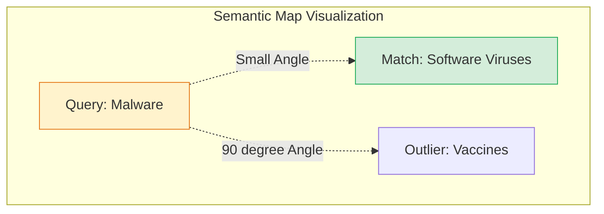
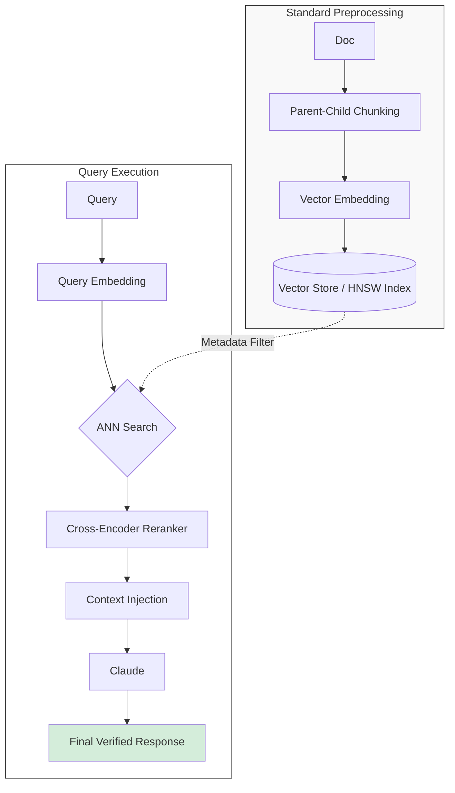

# Part 3: The Math of Search — Cosine Similarity and Vector Databases

By now, you've mastered [document chunking strategies](/posts/text-chunking-and-embeddings-in-rag) and the [architecture of indexing](/posts/mastering-rag-retrieval-augmented-generation). You have millions of dense vectors—some with over 1,500 dimensions—representing the semantic knowledge of your system. But how does a server find the most relevant chunk in under 50ms without doing a linear scan of every record?

The answer is a sophisticated combination of **High-Dimensional Geometry**, **Approximate Nearest Neighbor (ANN)** algorithms, and **Two-Stage Retrieval** pipelines. This post provides the mathematical and algorithmic foundation for production-grade vector search.

## The Geometric Intuition: Direction is Meaning

In traditional keyword search (lexical search), we look for exact string matches or partial overlaps. In vector search, we seek **Semantic Neighbors**. 

Imagine a "perfect" embedding model that only returns two numbers for simplicity—a 2D vector space.
1.  **Medical Score ($x$)**: How much the text relates to biological pathogens or clinical trials.
2.  **Tech Score ($y$)**: How much the text relates to algorithms or cloud infrastructure.

A document about "Software Infection Vectors" might yield a vector $A = [0.30, 0.97]$. A query about "Malware Analysis" might yield $Q = [0.28, 0.98]$. Despite having few matching words, these vectors are physically close in our 2D space. 

In high-dimensional space (e.g., 1,536 dimensions), we don't necessarily care about the "Euclidean Distance" (the straight line between the points) because the length of a vector can be influenced by the word count of the chunk. Instead, we focus on the **Angle** ($\theta$) between the two arrows. If two vectors point in the same direction, they share the same meaning—regardless of their magnitude.




## The Mathematical Foundation: Cosine Similarity

To debug retrieval quality issues, you must understand the underlying math. **Cosine Similarity** is the industry standard for semantic search because it focuses purely on the *direction* of the vectors.

The similarity is calculated as the dot product of two vectors $A$ and $B$, divided by the product of their magnitudes (norms). This results in a score between -1 and 1:

$$\text{similarity} = \cos(\theta) = \frac{\mathbf{A} \cdot \mathbf{B}}{\|\mathbf{A}\|\|\mathbf{B}\|} = \frac{\sum_{i=1}^{n} A_i B_i}{\sqrt{\sum_{i=1}^{n} A_i^2} \sqrt{\sum_{i=1}^{n} B_i^2}}$$

*   **Result of 1.0**: The vectors point in the exact same direction (identical semantic intent).
*   **Result of 0.0**: The vectors are orthogonal (completely unrelated topics).
*   **Result of -1.0**: The vectors point in opposite directions (diametrically opposed meanings).

### Why Over Euclidean Distance?
In high-dimensional spaces, we face the **Curse of Dimensionality**. As dimensions increase, the distance between any two points tends to converge, making Euclidean distance ($L_2$ norm) less stable for semantic comparison. Cosine similarity remains robust because it normalizes for the "intensity" of the chunk.

## Scaling to Millions: The ANN Algorithms

If you have 10 million chunks, a brute-force $O(N)$ scan would requiring performing 10B+ multiplication operations per query. This is computationally impossible for a real-time application. We use **Approximate Nearest Neighbor (ANN)** algorithms to trade a tiny bit of accuracy for massive gains in speed.

### 1. HNSW (Hierarchical Navigable Small World)
HNSW is the current gold standard for memory-resident vector search. It approaches the problem using **Graph Theory** and **Skip Lists**.
*   **The Layers**: HNSW builds a multi-layered graph. The top "express" layers have very few nodes and long-range connections. As you move down the layers, the graph becomes increasingly dense.
*   **The Search**: Search starts at a landmark node on the top layer, jumps to the closest neighbor, then "zooms in" to lower layers until it reaches the ground layer where all nodes exist.
*   **Complexity**: This reduces search time from $O(N)$ to $O(\log N)$.
*   **Parameters**: Senior engineers must tune `M` (maximum connections per node) and `efConstruction` (how hard the algorithm tries to find neighbors during index build).

### 2. IVF-PQ (Inverted File with Product Quantization)
When your dataset reaches the billions and RAM becomes the primary cost bottleneck, we turn to **IVF-PQ**.
*   **IVF (Clustering)**: We divide the vector space into "Voronoi cells" (clusters). At query time, we only search the nearest cluster.
*   **PQ (Quantization)**: This is the "lossy compression" of vectors. We split a 1536-dimensional vector into sub-vectors and map them to a codebook of centroids. This can compress vectors by up to 97%, allowing a billion vectors to fit on a single high-memory server.

## Deep Dive: The Vector Database Internal Architecture

A "Vector Database" is far more than just a place to store vectors. It is a specialized distributed system designed to solve the **High-Dimensional Retrieval Problem** at scale. Unlike a vector *library* (like FAISS or Annoy), a vector *database* provides ACID properties, multi-tenancy, and high availability.

### 1. Vector Library vs. Vector Database
*   **Vector Library**: A tool that helps you build a static index in memory. If your server crashes, the index is lost. It has no concept of "updates" (you must rebuild the whole index) and no horizontal scaling.
*   **Vector Database**: A managed service or self-hosted system (like Pinecone, Milvus, or Qdrant) that handles persistence, sharding, and real-time CRUD operations. You can insert a single document, and the DB will incrementally update its HNSW graph or IVF clusters.

### 2. The Metadata Filtering Paradox
One of the hardest problems in vector DB design is **Metadata Filtering**. Imagine you want to find "Documents similar to 'Security' AND created by 'John Doe'."
*   **Post-Filtering**: You retrieve Top-100 similar vectors first, then check their metadata for 'John Doe'. If only 2 of those match John, your final result is poor (low precision).
*   **Pre-Filtering**: You filter for 'John Doe' first, then perform vector search. This is computationally expensive because the HNSW graph might be disconnected after filtering out nodes.
*   **Industry Solution**: Modern databases like **Milvus** or **Qdrant** use a "Hybrid Execution Engine" that decides whether to pre-filter or post-filter based on the "selectivity" of the metadata (using cost-based optimization).

### 3. Storage Engines: Row vs. Columnar
In a traditional RAG query, you need two things: the **Vector** (for search) and the **Original Text** (for the prompt).
*   **Columnar Storage**: Stores vectors in a specialized memory-mapped format for fast SIMD processing.
*   **Document Store**: Stores the original text in a row-oriented block (like RocksDB or S3) to be retrieved only *after* the vector matches are found.

### 4. Disk-Resident Search: The DiskANN Breakthrough
Traditional HNSW requires the entire graph to live in RAM. At billion-scale, this is prohibitively expensive ($10,000s/month).
Researchers at Microsoft developed **DiskANN**, which allows the majority of the vector data and graph edges to live on SSDs, with only a small "landing pad" in RAM. This allows you to scale your RAG system 10x-100x larger for the same infrastructure cost, albeit with a slight increase in latency (moving from 20ms to 60ms).

### 5. Evaluating Your Vector DB Choice
| Feature | Pinecone (Serverless) | Qdrant (Rust) | Milvus (Cloud-Native) | Weaviate (Modular) |
| :--- | :--- | :--- | :--- | :--- |
| **Ease of Use** | Highest (Managed) | High | Medium | Medium |
| **Indexing** | HNSW/Internal | HNSW | HNSW/IVF/DiskANN | HNSW |
| **Language** | Proprietary | Rust | Go/C++ | Go |
| **Scale** | Global/Auto-scaling | Vertical/Horizontal | Massive Dist. | Pod-based |

---

## Search Architecture: The Two-Stage Pipeline

A common mistake is assuming that the Top-1 result from a vector search is the "Best" answer. Because embedding models are fuzzy, production systems use a **Two-Stage Pipeline** to ensure accuracy.

1.  **Stage 1: Retrieval (The Filter)**: Use a fast ANN search (HNSW) to pull the Top 100 candidates from your millions of chunks. This is "Bi-Encoder" retrieval—cheap and fast.
2.  **Stage 2: Reranking (The Refiner)**: Take those 100 candidates and pass them through a **Cross-Encoder** model. Unlike embeddings, a Cross-Encoder looks at the Query and the Chunk *together* to calculate a precise relevance score.

```python
import numpy as np
from typing import List, Tuple

class ProductionSearcher:
    def __init__(self, vector_db, reranker_model):
        self.db = vector_db
        self.reranker = reranker_model

    def _cosine_similarity(self, v1, v2):
        return np.dot(v1, v2) / (np.linalg.norm(v1) * np.linalg.norm(v2))

    def execute_search(self, query: str, top_k: int = 5) -> List[Tuple]:
        # Stage 1: Fast (but fuzzy) Retrieval
        # We pull 50 candidates to account for embedding 'jitter'
        candidates = self.db.ann_search(query, k=50)
        
        # Stage 2: Precise (but slower) Reranking
        # We use a Cross-Encoder to re-score the candidates
        scored_results = []
        for cand in candidates:
            # The reranker looks at the full text pairs
            score = self.reranker.predict((query, cand.text))
            scored_results.append((score, cand))
        
        # Sort by the new refined score
        scored_results.sort(key=lambda x: x[0], reverse=True)
        
        return scored_results[:top_k]
```

## The Hybrid Frontier: BM25 + Vector Search

In modern retrieval systems, the "Vector vs. Keyword" debate is over: **The answer is both**. Semantic search is terrible at finding specific IDs, codes, or medical terms like "COVID-19" (if the model was pre-training).

**Hybrid Search** combines the strengths of lexical search (BM25) with semantic search (Vector) using a technique called **Reciprocal Rank Fusion (RRF)**. This ensures that if a user searches for a specific part number, they get the exact match, but if they ask a broad conceptual question, they get the semantic match.

## Final Series Recap

We have gone from the high-level architecture of RAG to the microscopic engineering of chunking and the mathematical rigor of vector search.



RAG is the bridge between unstructured human knowledge and the structured logic of machines. By mastering the geometry of search and the engineering of data pipelines, you are building the foundation of the next generation of intelligent systems.

What will you build next? The frontier of Agentic RAG, Hybrid Retrieval, and Multimodal Vectors is yours to explore.
