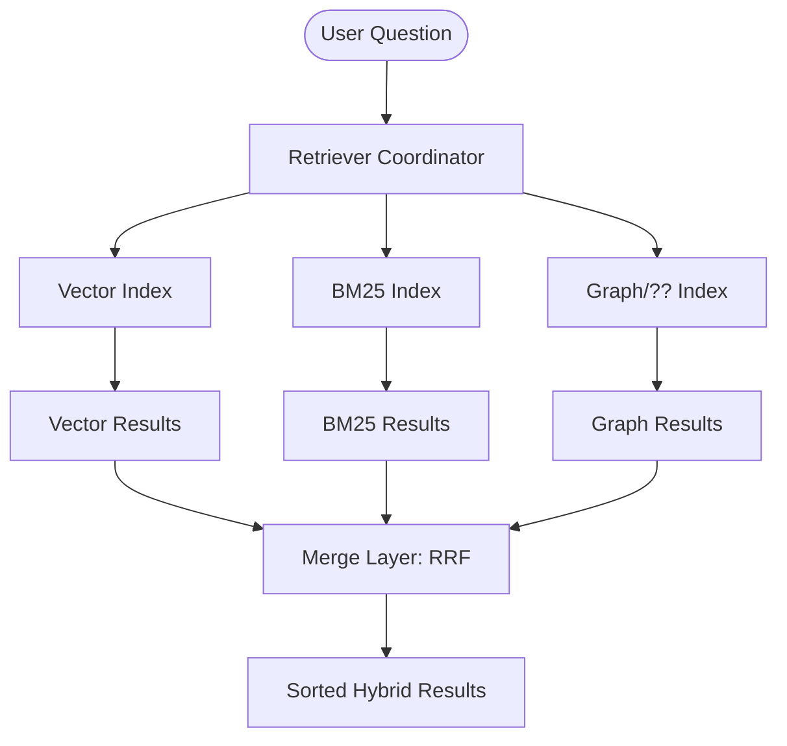

# The Multi-Index Architecture: Building an Extensible Hybrid Retriever

In our previous discussion on [Hybrid Retrieval with BM25](/posts/beyond-semantic-search-bm25-hybrid-retrieval), we established why relying on a single search methodology is a production anti-pattern. Semantic search captures intent, while lexical search captures precision. But identifying the need for both is only half the battle. The real engineering challenge lies in **Architecture**: How do we build a system that can combine these disparate signals without becoming a maintenance nightmare?

Enter the **Multi-Index Architecture**. This pattern is not just about "adding BM25 to your vector store." It is about building a modular, protocol-oriented retrieval system that can scale from two indices to twenty without changing a single line of your core application logic.

## The Coordinator Pattern: The Retriever Class

In a well-architected RAG system, your LLM should never know where the context came from. Whether it was pulled from a Pinecone vector index, an Elasticsearch BM25 cluster, or a dedicated Knowledge Graph, the interface should be identical.

We achieve this by implementing a **Retriever Coordinator**. This class acts as a central orchestrator that forwards user queries to multiple underlying indices, collects their raw results, and merges them into a single, unified ranking.



By maintaining a consistent API across all index types (typically an `add_document()` and a `search()` method), we can treat our indices as pluggable components. This is the **Open-Closed Principle** in action: our retrieval system is open for extension but closed for modification.


## The Normalization Crisis: Why RRF is Non-Negotiable

A common mistake when first building a hybrid system is trying to "normalize" scores. For example, you might try to force your BM25 scores (0 to 100) into a 0-1 range to match your Cosine Similarity. 

**This is a trap.** BM25 scores are not probabilities; they are log-likelihood ratios. Cosine similarity is a geometric projection. They are mathematically incompatible units of measurement. Trying to average them is like trying to calculate the average of 5 kilometers and 10 degrees Celsius.

The solution is **Reciprocal Rank Fusion (RRF)**. RRF ignores the "intensity" of the score and focuses entirely on the "consensus" of the ranking.

### The RRF Formula: A Closer Look

Each document $d$ in the union of your search results receives a score based on its rank in each individual index $i$:

$$\text{RRFscore}(d) = \sum_{i \in \text{Indexes}} \frac{1}{k + \text{rank}_i(d)}$$

Where:
-   $k$ is a constant (standardly 60) that prevents a single top result from a single index from overwhelming the entire system.
-   $\text{rank}_i(d)$ is the position of document $d$ in the results from index $i$ (starting at 1).

If a document appears as #1 in the Vector Index and #2 in the BM25 Index, its RRF score is extremely high. If it appears as #1 in Vector but is completely absent from BM25, its score is still healthy, but it might be overtaken by a document that performs well in *both* (e.g., #3 in both).

## Production Implementation: The Python Retriever

Below is a production-hardened implementation of a Multi-Index Retriever. Note the use of **Abstract Base Classes (ABCs)** to enforce a protocol across different search technologies.

```python
from abc import ABC, abstractmethod
from typing import List, Dict, Any
import numpy as np

class SearchIndex(ABC):
    @abstractmethod
    def add_document(self, document: Dict[str, Any]):
        pass

    @abstractmethod
    def search(self, query: str, k: int) -> List[Dict[str, Any]]:
        pass

class MultiIndexRetriever:
    def __init__(self, indexes: List[SearchIndex], k_rrf: int = 60):
        if not indexes:
            raise ValueError("At least one search index must be provided.")
        self.indexes = indexes
        self.k_rrf = k_rrf

    def add_document(self, document: Dict[str, Any]):
        # Broadcast document insertion to all indexes
        for index in self.indexes:
            index.add_document(document)

    def search(self, query: str, top_k: int = 5) -> List[Dict[str, Any]]:
        # 1. Gather raw results from all engines in parallel (conceptual)
        all_results = [idx.search(query, k=top_k * 2) for idx in self.indexes]
        
        # 2. Track document presence and scores
        # Key: Document ID or hash, Value: RRF Score
        doc_scores = {}
        # We also store the document content for the final list
        doc_registry = {}

        for engine_results in all_results:
            for rank, result in enumerate(engine_results, start=1):
                doc_id = result['id']
                doc_registry[doc_id] = result
                
                # Apply RRF scoring logic
                current_score = doc_scores.get(doc_id, 0.0)
                doc_scores[doc_id] = current_score + (1.0 / (self.k_rrf + rank))

        # 3. Sort by aggregated RRF score
        sorted_ids = sorted(doc_scores.keys(), key=lambda x: doc_scores[x], reverse=True)
        
        # 4. Return top K documents
        return [doc_registry[doc_id] for doc_id in sorted_ids[:top_k]]
```

## The Power of Extensibility: Beyond Vector + BM25

By adopting this architecture, you prepare your system for the future. Imagine your user base is complaining that the AI doesn't understand the "relationships" between companies (e.g., "Find all suppliers of Apple").

In a monolithic RAG system, you would have to refactor your entire pipeline to add a Graph Database. In a **Multi-Index Architecture**, you simply:
1.  Implement a new `GraphIndex` class following the `SearchIndex` protocol.
2.  Add it to your `MultiIndexRetriever` initialization list.

The RRF logic remains completely unchanged. It will automatically begin blending the "Knowledge Graph" signals with the "Semantic" and "Lexical" signals. 

## Testing the Hybrid Edge

Think back to our earlier problem: searching for specific incident IDs like `INC-2023-Q4-011`. 
-   **Vector-only**: Returns Section 10 (Cybersecurity) at Rank 1, but Section 3 (Finance) at Rank 2 because Finance mentions "Money" which is concepts-adjacent to "Incident" in the training data.
-   **Lexical-only**: Returns Section 10 at Rank 1 and Section 2 (Software Engineering) at Rank 2 because both contain the actual string.
-   **Hybrid (RRF)**: Section 10 rises to the top because it won in *both* indices. Section 2 (the highly relevant engineering notes) rises to #2 because the Lexical signal rescued it from the bottom of the Vector list.

## Conclusion: Engineering for Longevity

The Multi-Index Architecture is a commitment to **Information Diversity**. By refusing to settle for a single retrieval lens, you build a RAG system that is robust against the individual failures of any one technology. 

As the field of AI moves toward Agentic RAG and self-correcting retrieval, having a modular foundation like this is no longer optional—it is the prerequisite for building anything that survives the transition from demo to production.

In our next part, we will move from *Retrieval* to *Reasoning*: How to use these merged results to generate verifiable, citation-backed answers that users can trust.
