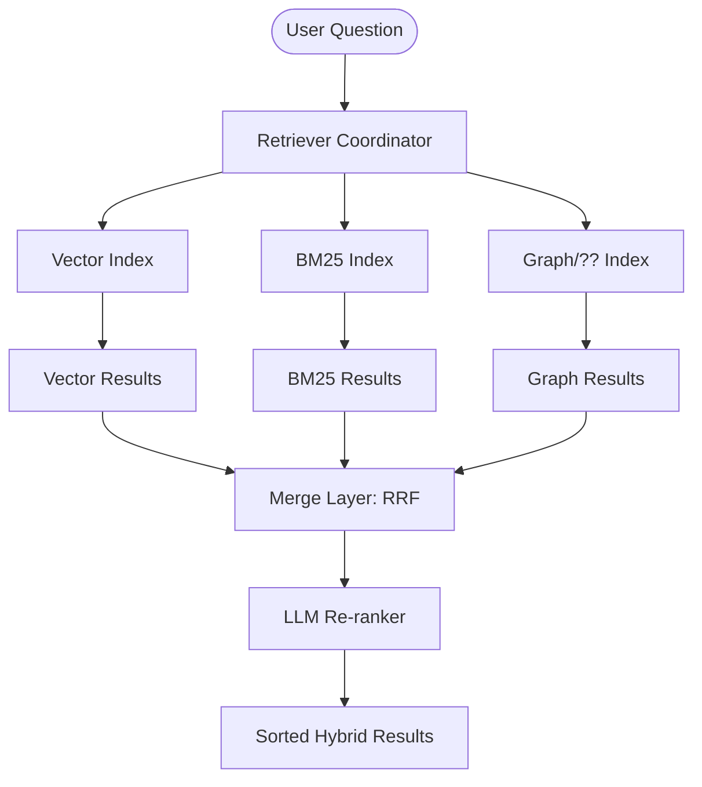

# Part 5: The Multi-Index Architecture: Building an Extensible Hybrid Retriever

In our previous discussion on [Hybrid Retrieval with BM25](/posts/beyond-semantic-search-bm25-hybrid-retrieval), we established why relying on a single search methodology is a production anti-pattern. Semantic search captures intent, while lexical search captures precision. But identifying the need for both is only half the battle. The real engineering challenge lies in **Architecture**: How do we build a system that can combine these disparate signals without becoming a maintenance nightmare?

Enter the **Multi-Index Architecture**. This pattern is not just about "adding BM25 to your vector store." It is about building a modular, protocol-oriented retrieval system that can scale from two indices to twenty without changing a single line of your core application logic.

## The Coordinator Pattern: The Retriever Class

In a well-architected RAG system, your LLM (Large Language Model) should never know where the context came from. Whether it was pulled from a Pinecone vector index, an Elasticsearch BM25 cluster, or a dedicated Knowledge Graph, the interface should be identical.

We achieve this by implementing a **Retriever Coordinator**. This class acts as a central orchestrator that forwards user queries to multiple underlying indices, collects their raw results, and merges them into a single, unified ranking.



By maintaining a consistent API across all index types (typically an `add_document()` and a `search()` method), we can treat our indices as pluggable components. This is the **Open-Closed Principle** in action: our retrieval system is open for extension but closed for modification.


## Deep Dive: Normalizing the Incompatible with RRF

A common mistake when first building a hybrid system is trying to "normalize" scores. For example, you might try to force your BM25 scores (range 0 to 50+) into a 0-1 range to match your Cosine Similarity. 

**This is a trap.** BM25 scores are log-likelihood ratios; cosine similarity is a geometric projection. They are mathematically incompatible units of measurement. Trying to average them is like trying to calculate the average of 5 kilometers and 10 degrees Celsius.

The solution is **Reciprocal Rank Fusion (RRF)**. RRF ignores the *intensity* of the score and focuses entirely on the *consensus* of the ranking.

### The RRF Walkthrough: Consensus in Action

Imagine we are searching for a technical incident `INC-2023-Q4-011`. 

1.  **Vector Index** returns:
    *   Rank 1: Section 2 (Software Engineering)
    *   Rank 2: Section 7 (Historical Research)
    *   Rank 3: Section 6 (Product Engineering)
2.  **BM25 Index** returns:
    *   Rank 1: Section 6 (Product Engineering)
    *   Rank 2: Section 2 (Software Engineering)
    *   Rank 3: Section 7 (Historical Research)

Instead of looking at the raw similarity scores, we apply the RRF formula:
$$\text{RRFscore}(d) = \sum_{i \in \text{Indexes}} \frac{1}{k + \text{rank}_i(d)}$$

Using $k=1$ for simple demonstration:
-   **Section 2**: $1/(1+1) + 1/(1+2) = 0.5 + 0.333 = \mathbf{0.833}$
-   **Section 6**: $1/(1+3) + 1/(1+1) = 0.25 + 0.5 = \mathbf{0.750}$
-   **Section 7**: $1/(1+2) + 1/(1+3) = 0.333 + 0.25 = \mathbf{0.583}$

The final winner is **Section 2**. It rose to the top because it performed consistently well (appearing in the top 2) across both search methodologies.

## Stage 2: LLM-Based Re-ranking

Even with RRF, the "Top-1" result might not be the most relevant. Hybrid search is still a "Bi-Encoder" approach—the model looks at the Query and Document separately. In production systems, we add a second stage: **LLM Re-ranking**.

In this stage, we take the top 10-20 results from our Hybrid search and send them to a high-reasoning model like Claude. Claude acts as a "Cross-Encoder," looking at the Full Query and the Full Document text simultaneously.

### The Re-ranking Prompt Strategy

To make re-ranking efficient and fast, you should avoid asking the model to rewrite text. Instead, have it return a sorted list of unique identifiers.

```markdown
You are tasked with finding the documents most relevant to a user's question.

<user_question>
What did the eng team do with INC-2023-Q4-011?
</user_question>

Here are documents that may be relevant:
<documents>
  <document>
    <id>ab84</id>
    <content>Section 10: Cybersecurity Analysis... [full text]</content>
  </document>
  ...
</documents>

Return the 3 most relevant doc IDs, in order of decreasing relevance, as a JSON list.
```

### Trade-offs: The Latency Penalty
Re-ranking is a "heavy" operation. It adds another 500ms to 2s to your retrieval cycle. However, for complex engineering queries where the difference between "relevant" and "accurate" is critical, this latency is almost always worth the precision gain.

## The Foundation: Contextual Retrieval

One of the most exciting breakthroughs in RAG is **Contextual Retrieval**. Standard chunking "shreds" a document into isolated pieces. When you embed Chunk 45, the model sees a few paragraphs but has forgotten that this is part of the "Security Audit" section of the "2024 Cloud Strategy" document.

Contextual Retrieval solves this by **situating** the chunk during the preprocessing/indexing phase.

### How it Works: The Situation Step
1.  **Input**: A raw chunk of text + the full source document.
2.  **LLM Step**: Claude generates a 1-2 sentence "situation" snippet (e.g., "This chunk is from the Cybersecurity Analysis section of the Project Phoenix Review, specifically discussing incident response.")
3.  **Output**: A "Contextualized Chunk" where the snippet is prepended to the original text.

This ensures that the embedding vector for the chunk captures both the **local detail** and the **global context**.


### Handling Large Documents
If your source document is too large for a single prompt, you can situatue chunks using a "Reduced Context" strategy:
-   Include the first 2 chunks of the document (Introduction/Abstract).
-   Include the 2 chunks immediately preceding the target chunk.
-   Ask the model to situatue the target chunk based on these boundary signals.

## Production Implementation: The Complete Retriever

```python
from abc import ABC, abstractmethod
from typing import List, Dict, Any
import json

class SearchIndex(ABC):
    @abstractmethod
    def search(self, query: str, k: int) -> List[Dict[str, Any]]:
        pass

class MultiIndexRetriever:
    def __init__(self, indexes: List[SearchIndex], reranker_fn=None):
        self.indexes = indexes
        self.reranker = reranker_fn

    def search(self, query: str, top_k: int = 5) -> List[Dict[str, Any]]:
        # 1. Parallel Hybrid Search
        all_results = [idx.search(query, k=top_k * 4) for idx in self.indexes]
        
        # 2. Merge with RRF
        merged_results = self._apply_rrf(all_results)
        
        # 3. Optional Stage 2: LLM Re-ranking
        if self.reranker:
            # We re-rank only the top 20 candidates for efficiency
            final_ids = self.reranker(merged_results[:20], query)
            # Re-order based on reranker consensus
            return self._sort_by_id_list(merged_results, final_ids)[:top_k]
        
        return merged_results[:top_k]

    def _apply_rrf(self, results_lists, k=60):
        # Implementation of RRF logic as discussed above...
        pass

# Example of a Contextual Embedding Preprocessor
async def contextualize_chunk(chunk: str, full_doc: str, client) -> str:
    prompt = f"Situatue this chunk within the document:\nDOC: {full_doc}\nCHUNK: {chunk}"
    response = await client.messages.create(...)
    return f"{response.context}\n{chunk}"
```

## Conclusion: Designing for Precision

The transition from a basic Vector Store to a **Multi-Index Architecture** with **Re-ranking** and **Contextual Retrieval** is what separates a toy demo from a production-ready AI system.

By maintaining consistent protocols between search engines and using LLMs strategically at both the *Preprocessing* (Contextual Retrieval) and *Runtime* (Re-ranking) stages, you build a system that is robust, explainable, and remarkably accurate.

What will you retrieval next? The architecture is ready for whatever you throw at it.
