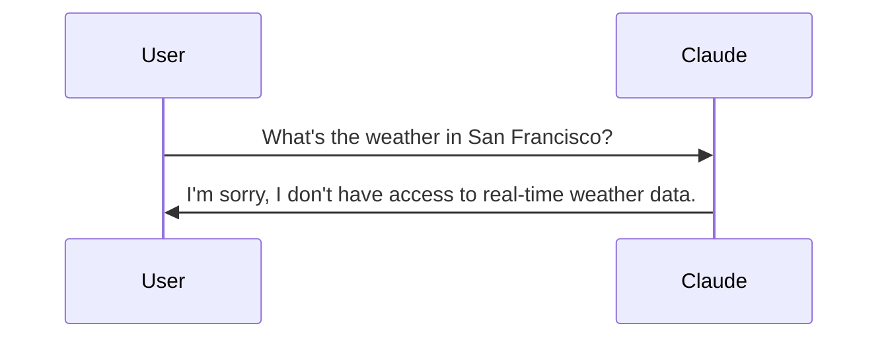
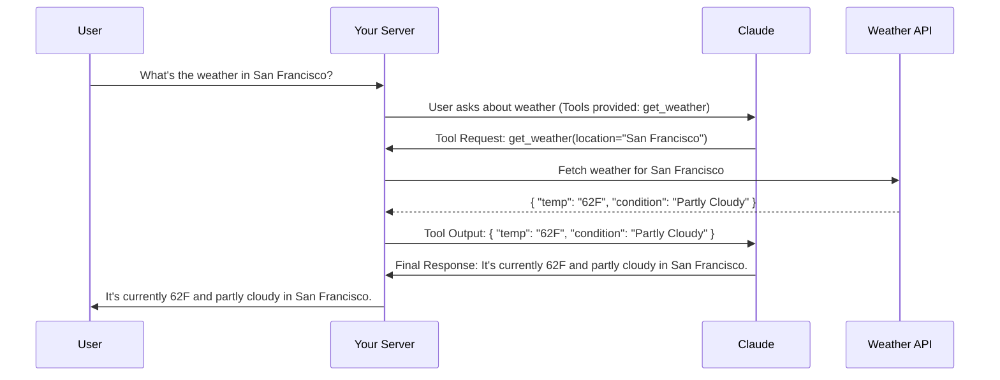

# Understanding Claude Tool Use

It is often asked how AI models like Claude can stay relevant when their training data has a cutoff date. Imagine asking for the current weather in San Francisco, only to have Claude politely tell you it doesn't have access to up-to-the-minute data. It is a bit like having a brilliant assistant who lives in a room with no windows. They know everything about the world up until they entered that room, but they cannot tell you if it is raining outside right now.

This is exactly where tool use enters the picture. It essentially gives Claude a set of windows—and doors—to the outside world, allowing it to fetch real-time information and interact with external systems.

## The Problem Without Tools

When Claude operates without tools, it hits a knowledge wall. It might be able to explain the physics of rainfall or the history of meteorology, but it cannot tell you whether you need an umbrella for your 2:00 PM meeting today. This limitation creates a disconnect. We want to use these models for practical, real-time tasks, yet they are inherently static.

Without tools, the interaction is a simple two-step process that often ends in an apology for anything current.



## How Tool Use Works

Tool use solves this by creating a structured back-and-forth between your application and Claude. It is less like a single question-and-answer and more like a collaboration. 

1. Initial Request: You send Claude a query along with a toolkit—instructions on how it can ask for extra data from external sources if it needs to.
2. Tool Request: Claude analyzes your question. If it realizes it needs more info, like that weather report, it stops and sends a request back to you, specifying exactly what tool it wants to use and what parameters it needs.
3. Data Retrieval: Your server sees this request, goes out to the actual API or database, and gets the fresh data.
4. Final Response: You send that data back to Claude. Now, equipped with both its original training and this new, specific information, Claude can finally give you a complete answer.

## Tool Use Interaction Flow

This process is highly orchestrated. Here is how that same weather question looks when Claude has the right tools at its disposal:



## Key Benefits of This Approach

1. Real-time Information: You can bridge the gap between trained knowledge and current reality by connecting to live APIs.
2. External System Integration: It is not just for reading data. You can give Claude the ability to write to databases, send emails, or even trigger complex workflows in other software.
3. Dynamic Responses: Every answer is grounded in the latest available information, making the assistant far more reliable for time-sensitive tasks.
4. Structured Interaction: Because Claude knows exactly what it needs, it can ask for it in a precise format like JSON, which makes it easy for your code to handle the request.

Tool use transforms Claude from a static encyclopedic knowledge base into a dynamic, active assistant. It is the difference between reading a weather textbook and having a weather station on your desk. By setting up these structured interactions, you unlock the ability to build applications that are truly helpful in the real world.

## From Concept to Code: Building Tool Functions


When building AI applications with Claude, you will often need to give it access to real-time information or the ability to perform actions. This is where tool functions come in—they are Python functions that Claude can call when it needs additional data to help users.

The image above shows three essential tools we often implement: getting the current date and time, calculating durations, and setting reminders. Let's start with how these work in practice.

### What Are Tool Functions?

A tool function is a plain Python function that gets executed automatically when Claude decides it needs extra information. For example, if someone asks, "What time is it?", Claude recognizes the intent and triggers your date/time tool to fetch the current response.

Here is an example of a weather tool function. It is important to notice how it validates inputs and provides clear error messages. These are not just for the user; they are for Claude too.

### Best Practices for Tool Functions

When writing your own tool functions, I recommend following these standards:

1. Use descriptive names: Both your function and parameter names should explicitly state what they do.
2. Validate inputs: Always check that required parameters are present and valid, raising errors where necessary.
3. Provide meaningful error messages: Claude can actually read these error messages and might attempt to fix its request based on your feedback.

Validation is particularly powerful because Claude can learn from these interactions. If you raise an error like "Location cannot be empty," Claude often understands the mistake and retries the call with a proper value.

### Building Your First Tool Function

Let's create a practical function to get the current date and time. This function accepts a format parameter so Claude can request different styles:

```python
def get_current_datetime(date_format="%Y-%m-%d %H:%M:%S"):
    if not date_format:
        raise ValueError("date_format cannot be empty")
    return datetime.now().strftime(date_format)
```

This uses Python's `datetime` module to fetch the time and format it. You can test it with various strings:

```python
# Default format: "2024-01-15 14:30:25"
get_current_datetime()

# Just hour and minute: "14:30"
get_current_datetime("%H:%M")
```

### Next Steps

Creating the function is just the beginning. Next, you will need to define a JSON schema that describes this function to Claude and integrate it into your orchestration layer. This approach keeps your code clean and maintainable while giving Claude the power to handle complex, real-world requests.

