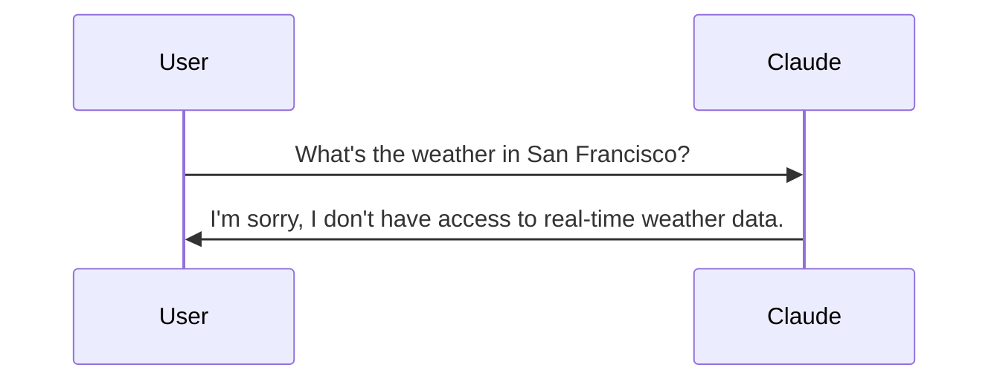
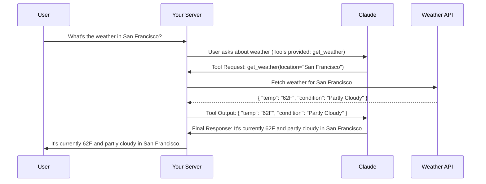

# Understanding Claude Tool Use

It is often asked how AI models like Claude can stay relevant when their training data has a cutoff date. Imagine asking for the current weather in San Francisco, only to have Claude politely tell you it doesn't have access to up-to-the-minute data. It is a bit like having a brilliant assistant who lives in a room with no windows. They know everything about the world up until they entered that room, but they cannot tell you if it is raining outside right now.

This is exactly where tool use enters the picture. It essentially gives Claude a set of windows—and doors—to the outside world, allowing it to fetch real-time information and interact with external systems.

## The Problem Without Tools

When Claude operates without tools, it hits a knowledge wall. It might be able to explain the physics of rainfall or the history of meteorology, but it cannot tell you whether you need an umbrella for your 2:00 PM meeting today. This limitation creates a disconnect. We want to use these models for practical, real-time tasks, yet they are inherently static.

Without tools, the interaction is a simple two-step process that often ends in an apology for anything current.



## How Tool Use Works

Tool use solves this by creating a structured back-and-forth between your application and Claude. It is less like a single question-and-answer and more like a collaboration. 

1. Initial Request: You send Claude a query along with a toolkit—instructions on how it can ask for extra data from external sources if it needs to.
2. Tool Request: Claude analyzes your question. If it realizes it needs more info, like that weather report, it stops and sends a request back to you, specifying exactly what tool it wants to use and what parameters it needs.
3. Data Retrieval: Your server sees this request, goes out to the actual API or database, and gets the fresh data.
4. Final Response: You send that data back to Claude. Now, equipped with both its original training and this new, specific information, Claude can finally give you a complete answer.

## Tool Use Interaction Flow

This process is highly orchestrated. Here is how that same weather question looks when Claude has the right tools at its disposal:



## Key Benefits of This Approach

1. Real-time Information: You can bridge the gap between trained knowledge and current reality by connecting to live APIs.
2. External System Integration: It is not just for reading data. You can give Claude the ability to write to databases, send emails, or even trigger complex workflows in other software.
3. Dynamic Responses: Every answer is grounded in the latest available information, making the assistant far more reliable for time-sensitive tasks.
4. Structured Interaction: Because Claude knows exactly what it needs, it can ask for it in a precise format like JSON, which makes it easy for your code to handle the request.

Tool use transforms Claude from a static encyclopedic knowledge base into a dynamic, active assistant. It is the difference between reading a weather textbook and having a weather station on your desk. By setting up these structured interactions, you unlock the ability to build applications that are truly helpful in the real world.

## From Concept to Code: Building Tool Functions


When building AI applications with Claude, you will often need to give it access to real-time information or the ability to perform actions. This is where tool functions come in—they are Python functions that Claude can call when it needs additional data to help users.

The image above shows three essential tools we often implement: getting the current date and time, calculating durations, and setting reminders. Let's start with how these work in practice.

### What Are Tool Functions?

A tool function is a plain Python function that gets executed automatically when Claude decides it needs extra information. For example, if someone asks, "What time is it?", Claude recognizes the intent and triggers your date/time tool to fetch the current response.

Here is an example of a weather tool function. It is important to notice how it validates inputs and provides clear error messages. These are not just for the user; they are for Claude too.

### Best Practices for Tool Functions

When writing your own tool functions, I recommend following these standards:

1. Use descriptive names: Both your function and parameter names should explicitly state what they do.
2. Validate inputs: Always check that required parameters are present and valid, raising errors where necessary.
3. Provide meaningful error messages: Claude can actually read these error messages and might attempt to fix its request based on your feedback.

Validation is particularly powerful because Claude can learn from these interactions. If you raise an error like "Location cannot be empty," Claude often understands the mistake and retries the call with a proper value.

### Building Your First Tool Function

Let's create a practical function to get the current date and time. This function accepts a format parameter so Claude can request different styles:

```python
def get_current_datetime(date_format="%Y-%m-%d %H:%M:%S"):
    if not date_format:
        raise ValueError("date_format cannot be empty")
    return datetime.now().strftime(date_format)
```

This uses Python's `datetime` module to fetch the time and format it. You can test it with various strings:

```python
# Default format: "2024-01-15 14:30:25"
get_current_datetime()

# Just hour and minute: "14:30"
get_current_datetime("%H:%M")
```

### Next Steps

Creating the function is just the beginning. Next, you will need to define a JSON schema that describes this function to Claude and integrate it into your orchestration layer. This approach keeps your code clean and maintainable while giving Claude the power to handle complex, real-world requests.

## Describing Your Tools: The Power of JSON Schema

Once you have written your tool function, the next step is creating a JSON schema. This essentially acts as a manual that tells Claude exactly what arguments your function expects and how to use them. Think of it as the documentation Claude reads to decide when and how to call your tools.


JSON Schema is a widely-used data validation specification. The AI community adopted it because it provides a reliable, structured way to describe function parameters. A complete tool specification consists of three main parts:

1. **name**: A clear, descriptive identifier for your tool (e.g., `get_weather`).
2. **description**: A narrative explanation of what the tool does, when it should be used, and what it returns.
3. **input_schema**: The actual JSON schema defining the function's arguments.

### Writing Effective Descriptions

Your tool description is the primary way Claude understands your function's purpose. To make it as effective as possible, I recommend:

1. Aiming for 3-4 clear sentences explaining the tool's core functionality.
2. Explicitly describing the scenarios where Claude should reach for this tool.
3. Explaining the type of data the tool returns.
4. Providing detailed context for each individual argument.

### The Easy Way to Generate Schemas

You don't actually have to write these complex JSON schemas from scratch. One of my favorite "meta" tricks is using Claude to generate the schema for you. Just copy your function code, provide the Anthropic documentation as context, and ask: *"Write a valid JSON schema spec for the purposes of tool calling for this function. Follow the best practices listed in the documentation."*

### Implementing the Schema in Code

Once you have your schema, integrate it using a clean naming pattern. I like to use `function_name_schema` to keep things organized:

```python
def get_current_datetime(date_format="%Y-%m-%d %H:%M:%S"):
    if not date_format:
        raise ValueError("date_format cannot be empty")
    return datetime.now().strftime(date_format)

get_current_datetime_schema = {
    "name": "get_current_datetime",
    "description": "Returns the current date and time formatted according to the specified format",
    "input_schema": {
        "type": "object",
        "properties": {
            "date_format": {
                "type": "string",
                "description": "A string specifying the format of the returned datetime. Uses Python's strftime format codes.",
                "default": "%Y-%m-%d %H:%M:%S"
            }
        },
        "required": []
    }
}
```

For even more robustness, you can add type safety using the Anthropic library's `ToolParam` type. This prevents subtle errors when building your request and makes your IDE a lot happier.

```python
from anthropic.types import ToolParam

get_current_datetime_schema = ToolParam({
    "name": "get_current_datetime",
    "description": "Returns the current date and time formatted according to the specified format",
    # ... rest of schema
})
```

## Handling Multi-Block Messages

When you enable tools, Claude's responses change. Instead of a simple block of text, you will start receiving multi-block messages. This is a significant shift in how you handle API responses.

### Making Tool-Enabled API Calls

To let Claude use your new tools, you must include them in the `tools` parameter of your API call. 

```python
messages = []
messages.append({
    "role": "user",
    "content": "What is the exact time, formatted as HH:MM:SS?"
})

response = client.messages.create(
    model=model,
    max_tokens=1000,
    messages=messages,
    tools=[get_current_datetime_schema],
)
```

### Understanding the Multi-Block Structure


When Claude decides to call a tool, it returns an assistant message where the `content` is a list of blocks. Typically, this includes:

1. **Text Block**: A human-readable explanation of what Claude is doing (e.g., *"I'll check the current time for you."*).
2. **ToolUse Block**: The technical instruction for your code, containing a unique ID, the tool name, and the specific input parameters formatted as a dictionary.

Crucially, when you save this to your conversation history, you must preserve the *entire* content structure—not just the text. Claude needs to see its own previous `tool_use` blocks to maintain context in the next turn.

```python
messages.append({
    "role": "assistant",
    "content": response.content
})
```

## Closing the Loop: Sending Tool Results

The final step in the workflow is executing the requested function and sending the result back to Claude.

### Running the Function

You can extract the parameters Claude sent and pass them directly to your Python function. Python's keyword argument unpacking (`**`) makes this incredibly clean:

```python
# Extract parameters from the second block (ToolUse)
tool_input = response.content[1].input

# Execute and unpack the dictionary into arguments
result = get_current_datetime(**tool_input)
```

### The Tool Result Block

Once you have your result, you send it back in a new `user` message using a `tool_result` block.


This block requires three key pieces of information:

1. **tool_use_id**: This must exactly match the ID from Claude's original request.
2. **content**: The actual output of your function, converted to a string.
3. **is_error**: A boolean flag that tells Claude if something went wrong during execution.

### Managing Multiple Tool Calls

Sometimes Claude will request multiple tools in a single message—for example, asking for both the current time and a weather report. Each request gets its own unique ID. By matching these IDs in your response, you ensure Claude correctly attributes each result, even if you process them in a different order than they were requested.

### The Final Request

When you send the tool results back, remember to still include the `tools` schema in your API call. Even if you aren't expecting another tool call, Claude needs that schema to understand the context of the entire conversation stored in your `messages` list.

```python
messages.append({
    "role": "user",
    "content": [{
        "type": "tool_result",
        "tool_use_id": response.content[1].id,
        "content": "15:04:22",
        "is_error": False
    }]
})

# Get the final natural language response
final_response = client.messages.create(
    model=model,
    max_tokens=1000,
    messages=messages,
    tools=[get_current_datetime_schema]
)
```

By completing this loop, you have transformed Claude from a text generator into an active agent capable of interacting with the real world through your custom code. This pattern of describing, observing, and responding is the foundation of almost every advanced AI application built today.

