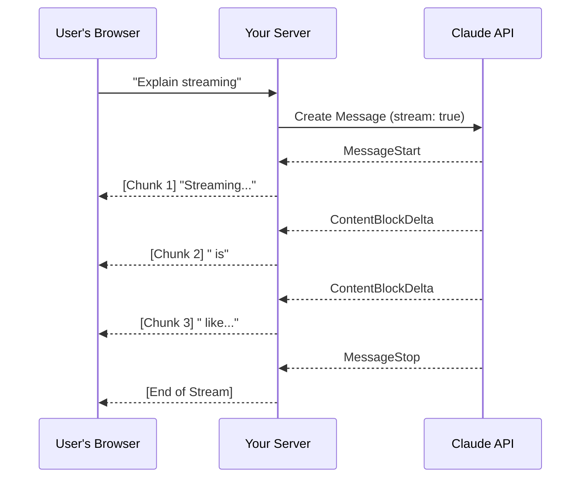

# Understanding LLM Streaming: Making AI Feel Instant

Have you ever used a tool where you click "Generate" and then stare at a loading spinner for 30 seconds? It feels like an eternity. But then you use something like ChatGPT or Claude, and the text starts appearing instantly, word-by-word. This magic is called **Streaming**, and it’s one of the most important features you can add to your AI apps to make them feel fast and alive.

In this post, we’re going to break down how streaming works with Claude, what’s happening behind the scenes, and how you can implement it in your own code.

## How Streaming Actually Works

Normally, an API request is like ordering a giant pizza. You place the order, wait for the whole thing to be cooked, and then it’s delivered all at once. If it’s a big pizza, you’re waiting a long time before you can even take a bite.

Streaming is more like a conveyor belt at a sushi restaurant. As soon as the chef finishes one piece, they put it on the belt, and you can start eating immediately while they prepare the next one. 

In technical terms, when you enable streaming, Claude doesn't wait to finish the entire response. Instead, it sends back an initial "receipt" saying it got your request, and then starts pushing out small chunks of text as they are generated. Your server then forwards these chunks to your user's screen in real-time.

### The Flow: Client, Server, and Claude

Here is a look at how the data moves between your user and the AI. Notice how the server acts as a relay, passing along small pieces of information as soon as they arrive.



## Decoding the Stream Events

When you turn on streaming, Claude sends a series of "events." Think of these like the chapters of a book. Here are the main ones you'll see:

*   **MessageStart**: "Hey, I'm starting a new message for you."
*   **ContentBlockStart**: "I'm about to start a block of text (or maybe a tool)."
*   **ContentBlockDelta**: This is the good stuff. These are the actual tiny pieces of text that you want to show your user.
*   **ContentBlockStop**: "I'm done with this specific block."
*   **MessageStop**: "That's everything! The conversation is complete."

While there are several event types, if you just want to show text to your user, you're mostly interested in the `ContentBlockDelta` events.

## Let's Look at the Code

Implementation is actually much simpler than it sounds. Here’s how you’d set up a basic stream using the official SDK.

### The Manual Way (Parsing Events)

If you want to see every single event (like start/stop markers), you can iterate through the stream directly:

```python
messages = [{"role": "user", "content": "Explain streaming in one sentence."}]

# We set stream=True to enable the conveyor belt
stream = client.messages.create(
    model="claude-3-5-sonnet-20240620",
    max_tokens=1000,
    messages=messages,
    stream=True
)

for event in stream:
    # This will print every event type (start, delta, stop)
    print(event)
```

### The Easy Way (Text Only)

Most of the time, you don't care about the technical markers—you just want the text. The SDK provides a "Text Stream" helper that filters out everything else for you:

```python
with client.messages.stream(
    model="claude-3-5-sonnet-20240620",
    max_tokens=1000,
    messages=messages
) as stream:
    for text in stream.text_stream:
        # print text as it arrives without newline
        print(text, end="", flush=True)
```

## Pro Tip: Saving the Result

One common mistake people make is forgetting that after the stream finishes, you usually need the *whole* message to save it to your database. You don't want to try and stitch all those hundreds of tiny pieces back together yourself!

Thankfully, the SDK stores the final result for you:

```python
with client.messages.stream(...) as stream:
    for text in stream.text_stream:
        # Send each chunk to your user
        pass
    
    # After the loop finishes, you can get the full, finished message
    final_message = stream.get_final_message()
    db.save(final_message.content)
```

## Why Should You Care?

Beyond just looking "cool," streaming drastically reduces **Time to First Token (TTFT)**. Even if the full response takes 10 seconds to generate, the user starts reading in less than 1 second. This makes your app feel significantly more responsive and professional.

Give it a try in your next project—your users’ patience will thank you!
