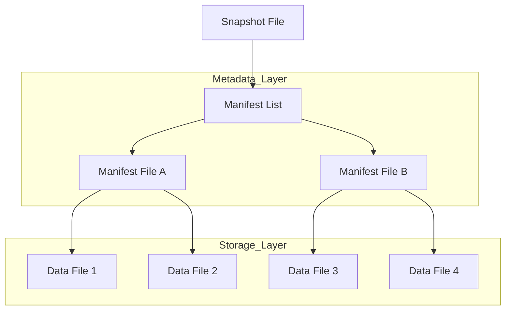

# The Architecture of Performance: Optimizing Spark with Parquet Delta and Iceberg

I remember the first time I tried to run a complex join on a multi-petabyte dataset stored entirely in raw CSV files. It was an absolute disaster. The cluster hummed, the executors groaned, and after four hours of shuffling data across the network, the job simply died with a cryptic out-of-memory error. We often treat Apache Spark like a magic wand that can solve any data scale problem, but the reality is that Spark is only as good as the data it touches. If you feed it inefficiently structured data, you are essentially asking a Formula 1 driver to race through a swamp.

The shift from simple file formats to sophisticated table formats like Delta Lake and Apache Iceberg has fundamentally changed how we build data pipelines. But simply using these formats isn't enough to guarantee performance. You need to understand the underlying mechanics of how Spark interacts with the storage layer to truly squeeze every ounce of efficiency out of your compute resources. We are going to explore the journey from basic file optimization to the advanced metadata management that defines the modern Lakehouse.

## The Foundation of Columnar Efficiency

Before we can talk about the fancy features of Delta or Iceberg, we have to respect the bedrock they are built upon: Apache Parquet. If you are still using row-based formats like CSV or JSON for large-scale analytical workloads, you are leaving an enormous amount of performance on the table.

Think of a row-based file like a traditional grocery store where every single item is scattered randomly. If you only want to buy milk, you still have to walk past the produce, the bakery, and the hardware section. Columnar storage, like Parquet, organizes the store so that all the milk is in one aisle, all the bread is in another, and all the electronics are in the back. When Spark queries a Parquet file for a specific column, it doesn't even look at the other columns. This is called Projection Pushdown.

Parquet takes this a step further with its internal structure. Every Parquet file is divided into Row Groups. Each Row Group contains column chunks, and each chunk is further divided into pages. The magic happens in the Footer. The Footer contains metadata including the min/max values for every column within every Row Group. 

1. Spark reads the Footer first.
2. It checks your query filters (e.g., WHERE age > 25).
3. If the metadata says the maximum age in a specific Row Group is 22, Spark skips that entire block of data without reading a single byte of it.

This is Predicate Pushdown. When you combine Projection and Predicate Pushdown, you reduce I/O by orders of magnitude. However, many engineers fail to realize that this only works if your data is physically organized in a way that makes those min/max ranges meaningful. If your data is perfectly shuffled, every Row Group will have a min age of 0 and a max age of 100, and Spark will be forced to read everything.

## The Death by a Thousand Cuts: The Small File Problem

One of the most common ways I see Spark jobs fail is through the accumulation of millions of tiny files. Spark creates a task for every file it needs to read. If you have ten million 1KB files, Spark will spend more time managing the overhead of opening and closing files than actually processing data. This is particularly prevalent in streaming applications where you might be writing data every few seconds.

To solve this, we have to be intentional about our file sizing. Ideally, you want your files to be between 128MB and 1GB. This size is large enough to benefit from Parquet's compression and metadata skipping but small enough to be handled efficiently by a single Spark task. 

In a standard Spark job, you can manage this using the coalesce() or repartition() methods before writing to disk. While repartition() triggers a full shuffle and can be expensive, it ensures that your data is evenly distributed across your output files. coalesce(), on the other hand, avoids a shuffle by merging local partitions, but it can lead to skewed file sizes if your initial partitions are uneven.

```python
# A production-ready approach to handling file sizes in Spark
def write_optimized_parquet(df, path, target_file_size_mb=256):
    # Calculate the number of partitions based on data volume
    # This is a heuristic to prevent the small file problem
    total_size_bytes = df.stats.sizeInBytes if hasattr(df, "stats") else 1024 * 1024 * 1024
    num_partitions = max(1, int(total_size_bytes / (target_file_size_mb * 1024 * 1024)))
    
    df.repartition(num_partitions) \
      .write \
      .mode("overwrite") \
      .parquet(path)
```

## Moving Beyond Files to Delta Lake

While Parquet is a great file format, it isn't a table format. It doesn't handle updates, deletes, or ACID transactions. This is where Delta Lake enters the picture. Delta Lake sits on top of Parquet and introduces a transaction log called the _delta_log. Every time you write to a Delta table, a new JSON file is added to this log, recording exactly which files were added and which were removed.

The real power of Delta Lake for optimization lies in its ability to perform Data Skipping and Z-Ordering. While standard partitioning (e.g., PARTITIONED BY date) is great for filtering by a single dimension, it falls apart when you have multiple high-cardinality columns you frequently filter by.

Z-Ordering is a technique that maps multi-dimensional data into a one-dimensional space while preserving locality. Imagine you frequently query by both user_id and timestamp. If you partition by user_id, your timestamp queries will be slow. If you partition by timestamp, your user_id queries will be slow. Z-Ordering re-arranges the data within the Parquet files so that related values for both columns are physically stored near each other.

```sql
-- Optimizing a Delta table for multi-dimensional queries
OPTIMIZE events_table
ZORDER BY (user_id, event_timestamp)
```

Running this command tells Delta Lake to rewrite the underlying Parquet files. It clusters the data so that the min/max statistics in the Parquet footers become much tighter. When Spark runs a query with a filter on either user_id or event_timestamp, it can skip vastly more data than it could with a simple sorted file. 

However, you must be careful. Z-Ordering is an expensive operation. It involves reading the data, sorting it, and writing it back out. I usually recommend running OPTIMIZE on a schedule—perhaps nightly or weekly—rather than after every single write. Furthermore, you should only Z-Order on columns that you actually use in your WHERE clauses. Adding too many columns to a Z-Order command will dilute the clustering effect until it provides no benefit at all.

## The Iceberg Evolution: Solving the Partition Wall

While Delta Lake relies on a linear transaction log, Apache Iceberg takes a different approach by using a hierarchical metadata tree. This structure allows Iceberg to scale to tables containing trillions of rows without the metadata itself becoming a bottleneck.

One of the most frustrating aspects of traditional Spark partitioning is that the user has to know how the data is partitioned to write an efficient query. If the table is partitioned by truncate(timestamp, 'day'), the user has to manually provide that truncated value in their query. If they just query by the raw timestamp, Spark might perform a full table scan.

Iceberg solves this with Hidden Partitioning. It tracks the relationship between the raw column and the partition transformation. When you query the raw column, Iceberg automatically applies the transformation to your filter and prunes the partitions for you.

1. The user writes: SELECT * FROM logs WHERE ts > '2024-01-01 08:00:00'.
2. Iceberg sees the table is partitioned by day.
3. Iceberg automatically translates the filter to only look in the 2024-01-01 partition.

This separation of the physical layout from the logical query is a game-changer for large teams. It allows data engineers to evolve the partitioning strategy (e.g., moving from daily to hourly partitions) without breaking any existing downstream queries. This is called Partition Evolution.

```python
# Configuring a Spark Session for Iceberg performance
from pyspark.sql import SparkSession

spark = SparkSession.builder \
    .config("spark.sql.extensions", "org.apache.iceberg.spark.extensions.IcebergSparkSessionExtensions") \
    .config("spark.sql.catalog.spark_catalog", "org.apache.iceberg.spark.SparkSessionCatalog") \
    .config("spark.sql.catalog.spark_catalog.type", "hive") \
    .config("spark.sql.catalog.local", "org.apache.iceberg.spark.SparkCatalog") \
    .config("spark.sql.catalog.local.type", "hadoop") \
    .config("spark.sql.catalog.local.warehouse", "/tmp/iceberg-warehouse") \
    .getOrCreate()
```

## Deep Technical Rigor: Metadata and Manifests

To understand why Iceberg can outperform Delta in certain massive-scale scenarios, we have to look at how they handle file lookups. Delta Lake reads its JSON log files and computes the current state of the table. For very large tables with frequent commits, this log can become massive, requiring Delta to create checkpoints (Parquet versions of the log) to speed up the process.

Iceberg uses a tiered metadata structure to facilitate constant-time lookups regardless of table size.



This hierarchy allows Iceberg to perform manifest pruning. Before it even opens a manifest file to see the list of data files, it checks the manifest list metadata. If the entire manifest file only contains data for a partition that doesn't match your query, Iceberg skips the manifest entirely. This O(log N) style lookup is significantly faster than scanning a flat list of files when you are dealing with millions of files.

## High-Concurrency Conflict Resolution

When you have multiple jobs writing to the same table simultaneously, you enter the realm of Optimistic Concurrency Control (OCC). Both Delta and Iceberg assume that most transactions won't conflict. They allow multiple writers to proceed and only check for conflicts at the very end when they try to commit the transaction.

1. Writer A reads the current state (Snapshot 1).
2. Writer B reads the current state (Snapshot 1).
3. Writer A finishes and commits (Snapshot 2).
4. Writer B finishes and tries to commit.

If Writer A and Writer B were modifying different partitions, both Delta and Iceberg will allow both commits. However, if they were modifying the same data, Writer B will fail with a concurrent modification exception and must retry. In Spark, you can tune how many times a job should retry these commits, which is critical for high-throughput streaming environments.

```python
# Tuning concurrency in Delta Lake via Spark configuration
spark.conf.set("spark.databricks.delta.retries", "10")
spark.conf.set("spark.databricks.delta.retryInterval", "1000ms")
```

## The Mathematical Reality of Data Skipping

Why does all this complexity matter? Let's look at it through the lens of algorithmic complexity. If you have N files and you perform a full scan, your complexity is O(N). For a table with 1,000,000 files, Spark has to coordinate 1,000,000 metadata requests to the underlying storage like S3 or ADLS.

By using partitioning, you reduce the search space to N/P, where P is the number of partitions. If you have 1,000 days of data, you've reduced your work by 1,000x. By adding Z-Ordering or Iceberg's manifest pruning, you are further reducing that search space by filtering at the file level using column statistics. If your Z-Order clusters data such that only 10% of files in a partition contain the relevant range of values, your effective N becomes (N/P) * 0.1. 

The goal of every optimization we've discussed is to get that N as close to 1 as possible. We want Spark to spend its time doing math in memory, not waiting for S3 to return a list of file headers. This is where the difference between a functional pipeline and a performant one lies.

## Practical Strategies for Table Maintenance

Whether you choose Delta or Iceberg, your Spark jobs will eventually slow down if you don't maintain the tables. Data isn't static. Over time, as you perform updates and deletes, the storage layer becomes fragmented.

1. Compaction: This is the process of taking those small files we discussed earlier and rewriting them into larger, optimized Parquet files. In Delta, this is handled by OPTIMIZE. In Iceberg, you use the rewriteDataFiles action.
2. Vacuuming/Expiring Snapshots: Both formats keep old versions of data to support Time Travel. If you don't periodically delete these old files, your storage costs will spiral out of control. In Delta, use VACUUM. In Iceberg, use expireSnapshots.
3. Schema Evolution: One of the biggest killers of Spark jobs is a sudden change in the upstream data format. Both Delta and Iceberg handle schema evolution gracefully, allowing you to add new columns without rewriting the entire table.

```python
# Iceberg Maintenance Action in PySpark
from iceberg.utils import bin_pack

# Compacting small files in an Iceberg table
# This action combines small files into larger ones (512MB)
spark.table("local.db.table_name") \
    .rewriteDataFiles() \
    .targetSizeInBytes(512 * 1024 * 1024) \
    .execute()
```

## Choosing the Right Path

If you are heavily invested in the Databricks ecosystem, Delta Lake is often the path of least resistance. Its integration with the Spark engine is deep, and features like Liquid Clustering are making the manual effort of Z-Ordering obsolete. It handles the heavy lifting of indexing and metadata management behind a user-friendly SQL interface.

If you are building a multi-engine environment where Spark, Trino, Flink, and Snowflake all need to touch the same data, Iceberg is often the superior choice. Its metadata-first approach and engine-agnostic design make it the gold standard for open data architectures. It provides a level of interoperability that prevents vendor lock-in and allows different teams to use the tool best suited for their specific workload.

The most important thing to remember is that no table format can save you from a bad data model. You must understand your access patterns. If 90% of your queries filter by organization_id, but you've partitioned your data by random_uuid, no amount of Z-Ordering or manifest pruning will save your performance. Optimization is a conversation between how you store the data and how you intend to ask it questions. 

When you align those two things, Spark stops being a source of frustration and starts being the high-performance engine it was designed to be. You move from fighting the framework to leveraging it, turning hours of compute time into minutes and significant cloud bills into manageable operational costs. This is the difference between an engineer who simply writes code and an architect who builds systems that scale for the long term.