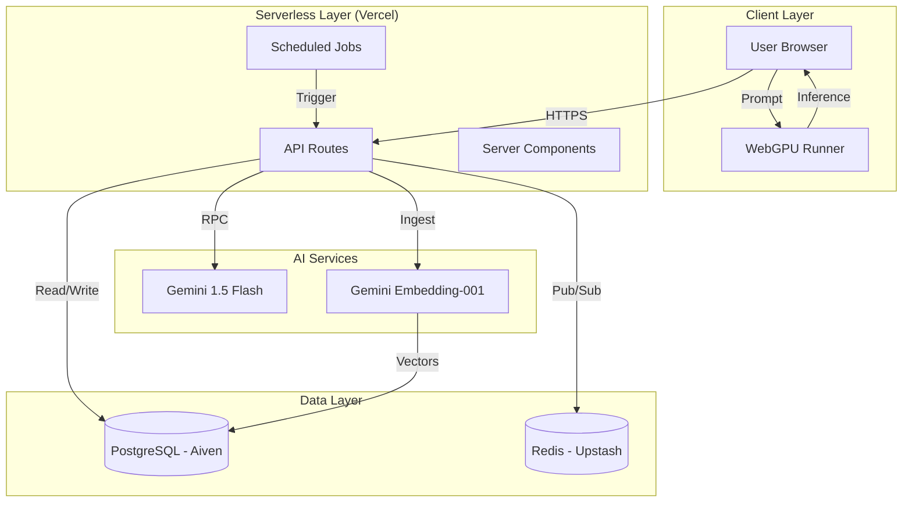

# System Architecture

## Overview
This project is a sophisticated **full-stack experimentation platform** built on Next.js 15. It integrates cloud-native AI services, local browser-based inference, and a hybrid data persistence layer.

## High-Level Diagram

## Core Subsystems

### 1. Data Layer (Dual Persistence)
We utilize a split-brain data strategy to optimize for both **relational consistency** and **real-time speed**.

#### PostgreSQL (Primary Store)
*   **Provider**: Aiven (Free Tier)
*   **Extensions**: `pgvector` (0.5.0), `uuid-ossp`
*   **Key Tables**:
    *   `users`: Auth & Profile data.
    *   `post_embeddings`: Master registry of indexed content (includes `content_hash` for change detection).
    *   `post_chunks`: Individual text chunks with `vector(768)` embeddings and `tsvector` for FTS.

#### Redis (Ephemeral Store)
*   **Provider**: Upstash / Aiven
*   **Use Cases**:
    *   **Notifications**: Pub/Sub channel for system alerts.
    *   **Job Status**: Tracking progress of long-running embedding jobs.
    *   **Rate Limiting**: (Planned) Preventing API abuse.

### 2. The Hybrid RAG Engine
*See [RAG Architecture](#hybrid-rag-architecture-deep-dive) below for deep dive.*

### 3. Local AI (Browser-Side)
We implement "Edge AI" using **WebLLM** and **WebGPU**.
*   **Engine**: `mlc-llm` (Machine Learning Compilation).
*   **Workflow**:
    1.  Browser checks for WebGPU support.
    2.  Fetches quantized model weights (e.g., `SmolLM2-135M-Instruct-q0f16-MLC`) from CDN.
    3.  Weights are cached in the browser's Cache API (persistent across reloads).
    4.  Inference runs entirely on the client GPU, bypassing the server.
*   **Supported Models**: `Llama-3.2-1B`, `SmolLM2-135M`, `Gemma-2B`.

---

## Hybrid RAG Architecture Deep Dive

Our engine uses a **Hybrid RAG** system designed to overcome the limitations of traditional semantic search and "Lost in the Middle" phenomenon.

### 1. Ingestion Pipeline
*   **Context-Aware Chunking**: We don't just split by character count. We split by Markdown headers.
    *   *Enrichment*: Every chunk is prepended with `DOCUMENT: {Post Title}\n\n` to preserve global context.
*   **Change Detection**: We store a MD5 `content_hash` of each post. The pipeline skips embedding if the hash hasn't changed, saving 90% of API calls on re-runs.

### 2. Retrieval Pipeline (The "And" Strategy)
We combine two search algorithms:
1.  **Semantic Search (`pgvector`)**: Finds conceptually similar content using Cosine Distance (`<=>`).
2.  **Lexical Search (`tsvector`)**: Finds exact keyword matches using Postgres Full Text Search (`ts_rank_cd`).

**Merging Strategy**:
`Score = (SemanticVector * 0.7) + (LexicalBM25 * 0.3)`

### 3. Agentic Reranking
Top 10 candidates from the DB are sent to **Gemini 1.5 Flash** with the prompt:
*"You are a Reranker. Rank these snippets by how well they answer the User Query."*

This step filters out "mathematically close but semantically irrelevant" results.

---

## Deployment & Operational Constraints

### Vercel Serverless Limits
*   **Problem**: Ingesting all posts takes >10s (Vercel Limit).
*   **Solution**: Recursive Batched Ingestion.
    *   The `/api/admin/index-posts` route processes a batch of 5 posts.
    *   If more posts remain, it returns a "Continue" signal (or would trigger a self-call in a worker setup).
    *   Currently manually triggered in batches via the Admin UI.

### Environment Variables
*   **Secure**: `GEMINI_API_KEY`, `POSTGRES_URL`, `REDIS_URL`.
*   **Public**: `NEXT_PUBLIC_SITE_URL` (for OG image generation).
